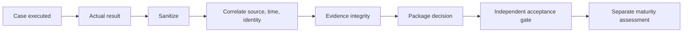

# 통제 검증 생명주기

## 패키지 수용 사례

- `positive`: 인가된 행동이 성공한다.
- `negative`: 비인가 행동이 거부된다.
- `bypass`: 우회·변형 경로가 통제를 회피하지 못한다.
- `persistence`: 재적용·재시작·reload 이후에도 통제가 유지된다.
- `rollback`: 이전의 안전 상태로 복구할 수 있다.
- `evidence_integrity`: 행동, 로그, 시각, 주체와 상태 기록이 일치한다.

설계상 적용 불가능한 분류는 생략하지 않고 `applicable: false`와 근거를 기록한다. 사례 ID는 패키지 범위와 행동을 설명하며 새 임의 번호 체계를 만들지 않는다.

## 증거 결정 흐름

```text
case executed -> actual result captured -> sensitive data sanitized
-> source/time/identity correlated -> evidence integrity checked
-> package decision proposed -> independent acceptance gate
-> maturity impact assessed separately
```



## 저장 경계

- 원시 증거: `.runtime/zero-trust/<package-or-action>/` 아래의 ignored 저장소
- 추적 증거: 검토·정제된 텍스트 기반 패키지 또는 action 증거만 허용
- 금지: 비밀번호, 개인키, MFA seed, 복구 코드, 토큰, 세션 쿠키, 전체 개인 식별자, 클라우드 자격증명, 사설 절대 경로
