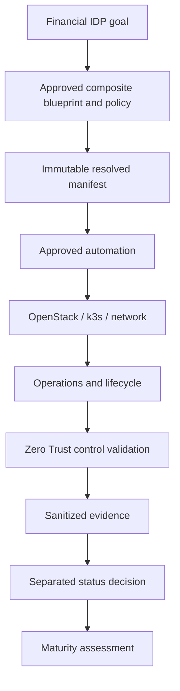

# 공식 프로젝트 정의

## 이름

- 공식 한국어명: **가상 증권사 Hybrid-Ready Private Cloud 기반 Internal Developer Platform 구축**
- Official English title: **Financial Hybrid-Ready Private Cloud Internal Developer Platform**
- 보안 프로그램명: **제로트러스트 가이드라인 2.0 기반 멀티클라우드 보안통제 구현 및 기술적 취약점 자동 검증 체계 구축**
- Security program title: **Implementation of Multi-Cloud Security Controls and Automated Technical Vulnerability Validation Based on Zero Trust Guideline 2.0**
- 기존 보안 포트폴리오명: **증적 기반 제로트러스트 멀티클라우드 보안 운영 플랫폼**

## 정의

금융권 운영·개발 조직이 승인된 인프라와 플랫폼 서비스를 카탈로그에서 신청하고, 정책·승인·자동화·관측·회수 절차를 통해 안전하게 사용하는 비운영 Internal Developer Platform 프로젝트다. OpenStack IaaS, k3s PaaS, 금융 네트워크 언더레이, 통합 운영 기능을 하나의 플랫폼으로 연결하며 Zero Trust와 KISA 기술 통제를 보안 검증면으로 적용한다.

금융 업무 범위에는 가상 증권사의 합성 주문 API, 사후처리, 포트폴리오·리스크 분석, 합성 시세 처리 검증을 포함한다. 모두 기존 approved composite blueprint에 고정 프로파일로 연결하며 실제 고객·계좌 데이터, 실주문, 거래소·브로커 연계, 실시간 시세 재배포와 운영 결제는 포함하지 않는다.

## 목적

1. OpenStack VM, 네트워크, 스토리지, VDI와 k3s 플랫폼 구성요소를 운영자가 승인한 조합형 상품으로 제공한다.
2. Terraform, Ansible, GitOps와 CI/CD로 승인된 변경을 재현 가능하게 수행한다.
3. 대표 PaaS 상품 `AI_AGENT_SANDBOX`에서 장기 비동기 AI 작업의 상태를 지속하고, 강격리 일회성 파드·승인·예산·체크포인트·Draft PR 전달을 통제한다.
4. 개발자 경험과 운영자 통제를 포털, 승인, 수명주기, 관측, 비용 인터페이스로 통합한다.
5. Nexus/IOS 기반 금융 네트워크의 동적 라우팅·멀티캐스트·분리 통제를 검증 가능한 형태로 준비한다.
6. 향후 퍼블릭 클라우드를 공급자 어댑터로 연결할 수 있는 계약을 유지한다.
7. Zero Trust 통제는 허용·거부·우회·지속성·롤백과 정제 증적으로 별도 검증한다.

## 권위 계층

```text
Platform goal and architecture
  -> approved composite blueprint and policy
  -> immutable resolved deployment manifest
  -> approved automation
  -> OpenStack / k3s / network target
  -> operational telemetry and lifecycle decision
  -> Zero Trust control validation
  -> sanitized evidence
  -> separate status and maturity decision
```



## 명시적 제외

실제 증거 없이 프로덕션 준비, 실제 증권 업무 처리, 규정 준수 인증, KISA 인증, 완전한 하이브리드 클라우드, L3 또는 L4 성숙도를 주장하지 않는다. 외부 클라우드가 구현·검증되기 전의 명칭은 `Hybrid-Ready`다.

## 보안 성숙도 경계

기존 Zero Trust 프로그램의 실제 완료 목표 `L3_ADVANCED`와 장기 `L4_OPTIMAL / ROADMAP_ONLY` 경계는 유지한다. 프로젝트 중심축 변경은 기존 패키지 구현·런타임 검증·수용·성숙도 상태를 자동으로 변경하지 않는다.
