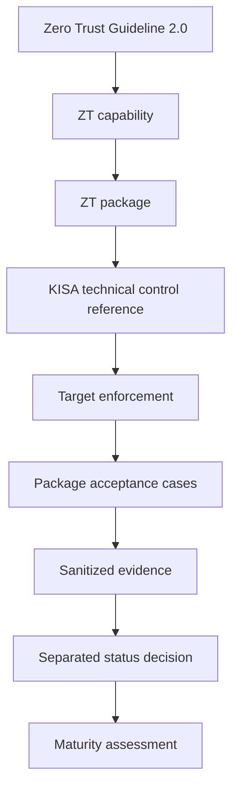

# 공식 프로젝트 정의

## 이름

- 공식 한국어명: **제로트러스트 가이드라인 2.0 기반 멀티클라우드 보안통제 구현 및 기술적 취약점 자동 검증 체계 구축**
- Official English title: **Implementation of Multi-Cloud Security Controls and Automated Technical Vulnerability Validation Based on Zero Trust Guideline 2.0**
- 포트폴리오명: **증적 기반 제로트러스트 멀티클라우드 보안 운영 플랫폼**

## 정의

제로트러스트 가이드라인 2.0 역량을 KISA 기술적 취약점 통제와 매핑하고, 여러 인프라 환경에 통제를 구현하며, 인가·비인가 행동을 검증하고, 성숙도 평가에 사용할 반복 가능한 정제 증적을 생성하는 패키지 중심 보안 엔지니어링 프로젝트다.

## 목적

1. 실제 인프라에 제로트러스트 통제를 안전하게 구현한다.
2. 제로트러스트 역량과 기술 점검·하드닝 통제를 연결한다.
3. 허용, 거부, 우회, 지속성, 롤백 행동을 독립적으로 검증한다.
4. 출처와 결과를 추적할 수 있는 정제 증적을 만든다.
5. 반복·예약 검증과 증적 최신성을 확립한다.
6. 성숙도는 검증된 구현 증거만으로 별도 평가한다.

## 명시적 제외

이 프로젝트는 제품 설치, 체크리스트 전용 진단, 단순 인프라 구축, 문서 전용 연구, KISA 인증, 규정 준수 인증 또는 완전한 L4 성숙도의 증명이 아니다.

## 완료 목표

실제 프로젝트 완료 목표는 `L3_ADVANCED`다. `L4_OPTIMAL`은 미래 아키텍처·역량 확장 로드맵이며 `ROADMAP_ONLY`다. 문서, 다이어그램, 도구 수 또는 설치 사실만으로 성숙도를 부여하지 않는다.

## 권위 계층

```text
Zero Trust Guideline 2.0
  -> ZT capability
  -> ZT package
  -> KISA technical control reference
  -> target enforcement
  -> package acceptance cases
  -> sanitized evidence
  -> separated status decision
  -> maturity assessment
```



어느 하위 계층도 자신이 보유한 실제 증거보다 높은 구현·검증·수용·성숙도·컴플라이언스 주장을 만들 수 없다.
