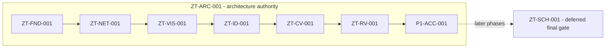

# Zero Trust 패키지 권위

## 권위 순서

1. 제로트러스트 가이드라인 2.0: 역량·아키텍처·성숙도 의미
2. 2026 주요정보통신기반시설 기술적 취약점 분석·평가 방법 상세가이드: 자산별 점검·하드닝 참조
3. `capability-catalog.yaml`: 역량 분류 권위
4. `package-flow.yaml`, 패키지 메타데이터와 `package-status.yaml`: 흐름·현재 상태 권위
5. `package-acceptance-cases.yaml`: 행동 검증 계약
6. 패키지 validator와 정제 증적: 실제 결과 권위
7. Markdown: 검토용 표현 계층

KISA 매핑은 구현·검증·컴플라이언스의 증거가 아니다.

## Phase 1

`ZT-ARC-001`이 다음 흐름 전체를 둘러싼다.

```text
ZT-ARC-001 surrounds:
ZT-FND-001 -> ZT-NET-001 -> ZT-VIS-001 -> ZT-ID-001
           -> ZT-CV-001 -> ZT-RV-001 -> P1-ACC-001
```

Phase 1은 `PARTIAL / PARTIALLY_VALIDATED / COMPLETED_WITH_GAPS`이며 경계는
`ZT-RV-001`이다. `P1-ACC-001`은 `P1-RV-FRESHNESS-001` 예외로
`ACCEPTED_WITH_GAPS`다. 기존 RV 기록은 계속 stale이고, 새 수동 갱신 창은
1/3(`STALE / EC3 / IN_PROGRESS`)이다. 두 번째 실행은
`2026-08-21T11:59:07.686986Z` 이후에만 가능하다. Phase 2의 P2-VIS-001은
한 개의 사설 비운영 OpenStack 모니터링 VM에서 부분 런타임 상태다. 네 개의
Terraform 리소스, 다섯 고정 이미지·서비스, 사설 mTLS, 정제 신호 수집,
재부팅 지속성, 패키지 전용 롤백, 보존 데이터 복구와 임시 접근 정리가 EC3에서
통과했다. ZT-VIS-002는 이에 따라 `PARTIALLY_IMPLEMENTED /
PARTIALLY_VALIDATED / PARTIALLY_ACCEPTED`로만 승격됐다. 실제 경보 전달,
보존기간 경과 동작, 전체 Cinder 스냅샷 재구축·재부착 복원은 열려 있으므로
P2-VIS-001 완료나 Phase 2 완료는 주장하지 않는다. `ZT-SCH-001`은
설치 상태를 보존한 채 비활성화되었으며
최종 Phase 5 작업으로 연기되었다.



## 경계

- 번호형 시나리오 권위와 후속 번호 체계는 없다.
- 문서·매핑·계획은 구현이나 런타임 상태를 승격하지 않는다.
- L3는 목표이지 현재 성숙도 주장이 아니다.
- L4는 `ROADMAP_ONLY`다.
- KISA 준수, 인증, 생산 준비 또는 전사 검증을 주장하지 않는다.
