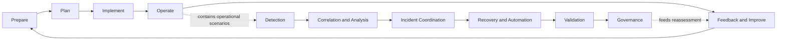

# Zero Trust Adoption Lifecycle

The source lifecycle and the repository scenario lifecycle coexist; they are not merged.

## Adoption Lifecycle

| Stage | Required input | Expected output | Repository documents |
|---|---|---|---|
| Prepare | Current state, assets, stakeholders, risks | Scope and gap baseline | scope lock, architecture, gap register |
| Plan | Priorities, target capabilities, constraints | Target design, policy, evidence plan | roadmap, matrices, scenario plans |
| Implement | Approved design and dependencies | Configured controls | implementation assets and logs |
| Operate | Running controls and telemetry | Measured behavior and incidents | evidence packages and runbooks |
| Feedback and Improve | Findings, exceptions, assessments | Revised gaps, targets and maturity | risk register, maturity records, roadmap |

Source: 제로트러스트 가이드라인 2.0, printed pp. 37-40, Figure 3-1 and the associated five-stage descriptions. Chapter 4 provides additional adoption guidance but is not the authority for the five-stage labels used here.

## Operational Scenario Lifecycle

Detection -> Correlation and Analysis -> Incident Coordination -> Recovery and Automation -> Validation -> Governance.

The adoption lifecycle governs program change. The operational lifecycle structures runtime behavior and evidence inside an adopted capability. A scenario may validate one operational step while the broader capability remains in Prepare or Plan.

