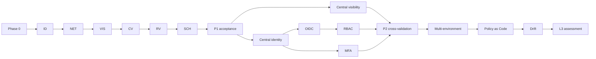

# Critical Path

```text
Phase 0 governance
-> bounded identity enforcement
-> network closure
-> local visibility closure
-> cross-validation
-> repeatability
-> scheduling
-> Phase 1 acceptance
-> central visibility + central identity
-> OIDC + MFA + RBAC
-> multi-environment expansion
-> Policy as Code + drift + continuous gates
-> L3 metrics, assessment, portfolio, demonstration and decision
```



병렬화는 게이트를 우회하지 않는다. Phase 2의 중앙 identity와 visibility는 Phase 1 수용 후에만 병렬 수행할 수 있고, Phase 3의 control workstream은 자산 권위가 먼저 완성되어야 한다.
