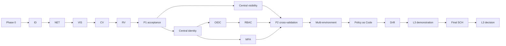

# Critical Path

```text
Phase 0 governance
-> bounded identity enforcement
-> network closure
-> local visibility closure
-> cross-validation
-> repeatability
-> Phase 1 acceptance
-> central visibility + central identity
-> OIDC + MFA + RBAC
-> multi-environment expansion
-> Policy as Code + drift + continuous gates
-> L3 metrics, assessment, portfolio and demonstration
-> final scheduled validation
-> final L3 decision
```



병렬화는 게이트를 우회하지 않는다. Phase 2의 중앙 identity와 visibility는 Phase 1 수용 후에만 병렬 수행할 수 있고, Phase 3의 control workstream은 자산 권위가 먼저 완성되어야 한다.

P1-ACC-001은 `P1-RV-FRESHNESS-001`을 수용하여
`ACCEPTED_WITH_GAPS`로 완료되었고 critical path는 P2-VIS-001 부분 런타임으로
진입했다. ZT-VIS-002는 한 개의 사설 비운영 OpenStack VM 범위에서 부분
구현·검증·수용되었으며, 경보 전달·보존기간 경과·전체 Cinder 스냅샷 복원은
열려 있다. 과거 세 RV 기록은 계속 stale이다. 별도 승인된 최신 수동 실행
1건이 추가되어 새 창은 1/3이며, 두 번째 실행은
`2026-08-21T11:59:07.686986Z` 이후에만 가능하다. SCH 재활성화나
P5-ACC-001 전에는 총 3건의 새 적격 창으로 반드시 해소해야 한다.
