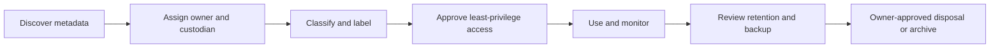

# ZT-DATA-001 Laboratory Data Governance Model

Status: **LABORATORY GOVERNANCE MODEL**. This model is limited to the bounded
non-production repository and pilot data listed in `data-inventory.yaml`. It
is not enterprise governance, legal classification, certification, or proof
of organization-wide discovery.

## Roles and decisions

| Role | Accountable decision |
|---|---|
| Data owner | Purpose, classification, access, retention, backup, restoration, sharing, and disposal approval |
| Data custodian | Approved storage, integrity, access implementation, and evidence handling |
| Platform administrator | Platform configuration within separately approved mutation authority |
| Application owner | Application-data purpose, workload relationship, and service-impact review |
| Security reviewer | Least privilege, DLP findings, exceptions, and evidence-boundary review |
| Backup operator | Approved backup/restore execution without overwriting the source |
| Evidence reviewer | Sanitization, provenance, authority, and claim review |
| Data consumer | Approved actions only; no onward export or reclassification |
| Emergency-access authority | Time-bounded, logged, separately approved exceptional access and recovery |

## Workflow

The data owner assigns an owner and custodian before an active protected asset
is accepted. Classification changes, access expansion, retention changes,
backup activation, restore onto a non-test target, exceptions, and disposal
require the owner plus the relevant custodian or security reviewer. Emergency
access must be explicit, expiring, logged, recoverable, and reviewed after use.

Reviews are evidence-driven and periodicity is owner-defined until a later
package establishes scheduling. Evidence records include stable asset/policy
IDs, decision, authority, sanitized outcome, limitations, and expiration for
exceptions. No record contains a secret value or full sensitive record.

## Lifecycle and ownership

## Exception boundary

An exception records the data asset, control, owner, reviewer, rationale,
compensating control, expiration, rollback, and evidence. It never silently
changes the authoritative classification or enables wildcard access. Physical
media, legal holds, and enterprise privacy obligations remain outside this
laboratory package.
