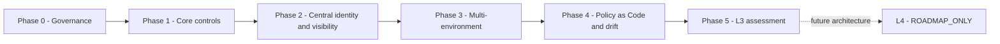

# L3 구현 로드맵

실제 완료 목표는 `L3_ADVANCED`; `L4_OPTIMAL`은 `ROADMAP_ONLY`다. 이 문서는 계획 권위이며 현재 패키지 구현·검증·수용 상태를 승격하지 않는다.

```text
Phase 0 Governance
-> Phase 1 Core controls
-> Phase 2 Central identity and visibility
-> Phase 3 Multi-environment expansion
-> Phase 4 Policy as Code and continuous validation
-> Phase 5 L3 assessment
-> L4 future roadmap only
```



## Phase 0

번호형 시나리오 은퇴, 패키지 수용 사례, 공식 프로젝트 정의, 검증된 KISA 참조와 매핑 방법론, 상태·스키마·검증기를 정규화한다. 구현 상태는 승격하지 않는다.

## Phase 1

`P1-ID-ENF-001-RETRY -> P1-NET-CLOSE -> P1-VIS-CLOSE -> P1-CV-001 -> P1-RV-001 -> P1-SCH-001 -> P1-ACC-001` 순서를 지킨다.

## Phase 2

중앙 모니터링, Keycloak, OIDC, MFA, 중앙 RBAC와 교차검증을 구축하고 런타임 증거가 생기기 전에는 구현으로 표시하지 않는다.

## Phase 3

자산·워크로드 신원, 분할, 애플리케이션, 데이터·백업 통제를 최소 두 개의 서로 다른 실제 배포 환경으로 확장한다.

## Phase 4

버전 관리 정책, 사전 검증, drift, 승인 기반 대응, 회귀검사와 권위 대시보드를 구축한다. 파괴적 자동 대응은 기본값이 아니다.

## Phase 5

지표, 도메인별 성숙도, 포트폴리오와 재현 가능한 시연을 평가한다. 최종 결정은 성공을 강제하지 않고 `L3_ADVANCED_SUPPORTED_BY_EVIDENCE` 또는 `L3_NOT_YET_ACHIEVED`다.

세부 행동·의존성·증거·위험·중단 조건은 `final-execution-plan.yaml`이 권위다.
