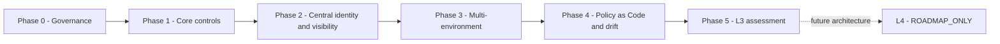

# L3 구현 로드맵

실제 완료 목표는 `L3_ADVANCED`; `L4_OPTIMAL`은 `ROADMAP_ONLY`다. 이 문서는 계획 권위이며 현재 패키지 구현·검증·수용 상태를 승격하지 않는다.

```text
Phase 0 Governance
-> Phase 1 Core controls
-> Phase 2 Central identity and visibility
-> Phase 3 Multi-environment expansion
-> Phase 4 Policy as Code and continuous validation
-> Phase 5 L3 assessment
-> L4 future roadmap only
```



## Phase 0

번호형 시나리오 은퇴, 패키지 수용 사례, 공식 프로젝트 정의, 검증된 KISA 참조와 매핑 방법론, 상태·스키마·검증기를 정규화했다. `P0-ACC-001`의 거버넌스 수용 결정으로 Phase 0은 `COMPLETED`다. 이 결정은 구현·런타임·증거·성숙도·규정 준수 상태를 승격하지 않는다.

## Phase 1

`P1-ID-ENF-001-RETRY -> P1-NET-CLOSE -> P1-VIS-CLOSE -> P1-CV-001 -> P1-RV-001 -> P1-ACC-001` 순서를 지킨다. SCH는 Phase 1 선행조건이 아니다.

P1-ACC-001은 `P1-RV-FRESHNESS-001` 예외를 명시적으로 수용하여
`ACCEPTED_WITH_GAPS`로 완료되었다. 세 RV 실행의 역사적 EC4 결정은
보존하지만 모두 P7D를 초과하며 현재 EC4 freshness로 재분류하지 않는다.
새 수동 RV 창은 최종 SCH 재활성화 및 P5-ACC-001 전에 반드시 닫아야 한다.

## Phase 2

현재 `IN_PROGRESS_PARTIAL_RUNTIME`이다. `P2-VIS-001`은 한 개의 사설 비운영
OpenStack 모니터링 VM에서 `PARTIALLY_IMPLEMENTED / PARTIALLY_VALIDATED /
PARTIALLY_ACCEPTED`이며, 경보 전달·보존기간 경과·전체 Cinder 스냅샷 복원이
완료되기 전에는 P2-VIS-001 완료로 표시하지 않는다. Keycloak, OIDC, MFA,
중앙 RBAC와 교차검증은 아직 후속 작업이다.

## Phase 3

자산·워크로드 신원, 분할, 애플리케이션, 데이터·백업 통제를 최소 두 개의 서로 다른 실제 배포 환경으로 확장한다.

## Phase 4

버전 관리 정책, 사전 검증, drift, 승인 기반 대응, 회귀검사와 권위 대시보드를 구축한다. 파괴적 자동 대응은 기본값이 아니다.

## Phase 5

지표, 도메인별 성숙도, 포트폴리오와 재현 가능한 시연을 평가한다. 비활성화된 `ZT-SCH-001`은 시연 이후 최종 예약 검증 게이트로 수행한다. 최종 결정은 성공을 강제하지 않고 `L3_ADVANCED_SUPPORTED_BY_EVIDENCE` 또는 `L3_NOT_YET_ACHIEVED`다.

세부 행동·의존성·증거·위험·중단 조건은 `final-execution-plan.yaml`이 권위다.
