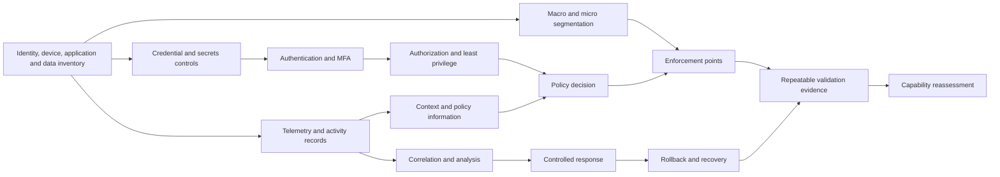

# Zero Trust Guideline 2.0 Laboratory Implementation Blueprint

## Purpose

This document turns the repository capability taxonomy, baseline assessment, and gap register into a conservative laboratory implementation plan. It is a portfolio-grade engineering blueprint, not an enterprise compliance assessment, certification, or claim that the planned controls are operating.

The machine-readable authority is the [capability implementation backlog](capability-implementation-backlog.yaml). Capability names and source traceability remain authoritative in the [capability catalog](capability-catalog.yaml).

## Current-state boundary

As of 2026-07-17, the evidenced runtime boundary is limited to:

- EVE-NG network foundation: VLAN segmentation, router-on-a-stick routing, NAT/PAT, and directional ACL behavior.
- OpenStack all-in-one networking: provider and tenant paths, Neutron routing, floating-IP DNAT, and instance outbound connectivity.
- Repository governance: the locked retired numbered scenario framework model, evidence conventions, Zero Trust catalog/baseline synchronization, schemas, and repeatable local validators.

The following are not currently established as operating Zero Trust controls: enterprise identity lifecycle, MFA, PAM, endpoint management, Kubernetes workload controls, MariaDB controls, centralized monitoring/correlation, DLP, automated response, AWS/Azure integration, and continuous trust evaluation. Existing example files and planned architecture are not runtime evidence.

## Target architecture

The target is a staged laboratory control plane in which identity, device, workload, network, data, and telemetry context become policy inputs; an explicit decision function evaluates those inputs; provider-native or workload-native enforcement points apply bounded decisions; and sanitized evidence records both allowed and denied outcomes. The architecture deliberately separates:

1. inventory and context acquisition;
2. policy definition and decision;
3. enforcement and rollback;
4. telemetry and correlation;
5. validation and evidence acceptance.

No layer is considered implemented until configuration or runtime evidence is accepted under the repository evidence model.

## Zero Trust logical alignment

> **CONCEPTUAL ALIGNMENT** — The following mapping describes intended logical roles. It does not claim a complete Zero Trust architecture.

| Logical role | Laboratory interpretation | Current state |
|---|---|---|
| Policy Information Point (PIP) | Identity, device, workload, network-flow, data-classification, configuration, and telemetry sources | PLANNED; limited network facts and repository metadata exist |
| Policy Engine (PE) | Evaluates normalized context against approved policy | PLANNED |
| Policy Decision Point (PDP) | PE plus policy administration coordination and decision recording | PLANNED |
| Policy Administrator (PA) | Translates an approved decision into a bounded, reversible change | PLANNED |
| Policy Enforcement Point (PEP) | Router ACL, cloud security rule, host access control, workload policy, application authorization, or data access control | PARTIALLY EVIDENCED only for the current EVE-NG/OpenStack network boundary |

## Capability dependency model

The complete acyclic dependency graph is encoded in the backlog. Documentation of an edge is planning evidence only; it does not satisfy either endpoint.

## Implementation waves

### Wave 0 — Governance and Evidence Foundation

- **Objectives:** preserve source traceability; normalize telemetry/evidence; define policy integration and reversible automation boundaries.
- **Prerequisites:** locked retired numbered scenario framework set, catalog and baseline schemas, current repository validators.
- **Included capabilities:** ZT-1.1.1, ZT-2.3.1, ZT-7.1, ZT-8.5.
- **Implementation deliverables:** evidence contracts, policy-input schema, automation approval/rollback rules, normalized exchange format.
- **Validation deliverables:** schema, synchronization, overclaim, secret, link, scenario-lock, and repeatability checks.
- **Evidence deliverables:** validator logs, generated summaries, accepted design/configuration evidence references.
- **Entry criteria:** catalog and baseline parse; authority and actual-state boundary are explicit.
- **Exit criteria:** Gate ZT-0 passes; evidence acceptance and rollback authorities are named.
- **Rollback:** revert planning/schema changes and preserve the last accepted catalog/baseline snapshot.
- **Unresolved gaps:** immutable evidence storage and external review authority remain laboratory-limited.

### Wave 1 — Infrastructure and Trust Foundations

- **Objectives:** establish inventories, restricted administration, segmentation, telemetry sources, configuration state, and recovery prerequisites.
- **Prerequisites:** Wave 0 exit; stable EVE-NG/OpenStack boundary; sanitization workflow.
- **Included capabilities:** ZT-1.4.2, ZT-3.1.1, ZT-3.1.3, ZT-3.4.1, ZT-3.5.1, ZT-4.1.1, ZT-4.2.1, ZT-4.2.2, ZT-4.3.1, ZT-4.4.1, ZT-8.1, ZT-8.2.
- **Implementation deliverables:** bounded inventories; least-privilege administrative path; credential rules; flow map; recoverable baseline configuration.
- **Validation deliverables:** positive/negative access tests, inventory reconciliation, segmentation and recovery checks.
- **Evidence deliverables:** sanitized configuration snapshots, runtime outputs, deny/allow results, rollback proof.
- **Entry criteria:** Gate ZT-1 inputs are available and no unmanaged secret is required.
- **Exit criteria:** foundational dependencies have accepted evidence and no critical rollback gap.
- **Rollback:** restore known-good configuration and revoke temporary access.
- **Unresolved gaps:** enterprise PAM/UEM and fleet-scale patch automation remain partial or reference-only.

### Wave 2 — Identity, Endpoint, and Workload Controls

- **Objectives:** add bounded authentication, MFA, identity federation, host posture, workload identity, and policy enforcement.
- **Prerequisites:** Wave 1 inventories, credentials, access control, segmentation, telemetry, and rollback.
- **Included capabilities:** ZT-1.1.2, ZT-1.2.1, ZT-1.2.2, ZT-1.4.1, ZT-2.1.1, ZT-2.2.1, ZT-2.4.2, ZT-3.1.2, ZT-5.1.1, ZT-5.2.1, ZT-5.3.1, ZT-5.4.2.
- **Implementation deliverables:** lab IdP boundary, MFA, role mapping, host-compliance assertions, workload inventory/identity, bounded micro-segmentation.
- **Validation deliverables:** valid/invalid identity, stale context, bypass, enforcement failure, and recovery tests.
- **Evidence deliverables:** redacted auth decisions, policy/configuration snapshots, deny/allow and recovery results.
- **Entry criteria:** Gate ZT-2 passes for each implementation package.
- **Exit criteria:** identity/device/workload dependencies are tested without enterprise-wide claims.
- **Rollback:** revoke sessions/credentials, restore prior policies, and revalidate the administrative path.
- **Unresolved gaps:** biometric context and integrated enterprise ICAM remain reference-only.

### Wave 3 — Application, Software, and Data Protection

- **Objectives:** protect software delivery, application access, secrets, data inventory/classification, encryption patterns, and backups.
- **Prerequisites:** Wave 2 identity/workload context and enforcement; approved test data.
- **Included capabilities:** ZT-3.3.1, ZT-5.4.1, ZT-5.5.1, ZT-5.5.2, ZT-6.1.1, ZT-6.2.1, ZT-6.3.1, ZT-6.4.1, ZT-6.5.2.
- **Implementation deliverables:** application/software inventory, dependency/image checks, data labels, access/encryption controls, backup assurance.
- **Validation deliverables:** tampered artifact, unauthorized data access, missing label/key, backup and restore tests.
- **Evidence deliverables:** scan/configuration results, redacted access decisions, integrity records, restore verification.
- **Entry criteria:** Gate ZT-3 passes and destructive tests have explicit approval.
- **Exit criteria:** application and data controls meet their capability-specific targets with accepted limitations.
- **Rollback:** restore trusted artifact/configuration, rotate affected secrets, and recover test data.
- **Unresolved gaps:** enterprise governance and full DLP remain reference-only.

### Wave 4 — Visibility, Correlation, and Automated Response

- **Objectives:** correlate normalized telemetry, assess behavior/threat signals, and execute approval-gated reversible response.
- **Prerequisites:** reliable Wave 0 telemetry contracts and Waves 1-3 enforcement/rollback controls.
- **Included capabilities:** ZT-3.2.1, ZT-7.3, ZT-7.4, ZT-8.3, ZT-8.4, ZT-8.6.
- **Implementation deliverables:** bounded correlation rules, operational anomaly analysis, incident coordination, safe response runbooks.
- **Validation deliverables:** true/false positive, missing-signal, failed action, rollback, and operator-approval tests.
- **Evidence deliverables:** sanitized events, correlations, decisions, approvals, actions, and recovery results.
- **Entry criteria:** trusted inputs, decision authority, failure containment, and rollback are demonstrated.
- **Exit criteria:** Gate ZT-4 passes for each bounded response path.
- **Rollback:** disable automation, restore affected state, preserve evidence, and require manual recovery.
- **Unresolved gaps:** enterprise SIEM, threat-intelligence contracts, and production SOAR remain reference-only.

### Wave 5 — Continuous Verification and Maturity Reassessment

- **Objectives:** continuously re-evaluate bounded policies and use accepted evidence to recalculate capability gaps.
- **Prerequisites:** Waves 0-4 have repeatable checks and stable evidence contracts.
- **Included capabilities:** ZT-7.6.
- **Implementation deliverables:** guarded dynamic-policy prototype and periodic reassessment workflow.
- **Validation deliverables:** drift, stale context, unavailable decision point, unsafe response prevention, and recovery tests.
- **Evidence deliverables:** repeated results, drift records, approved changes, rollback proof, and reassessment deltas.
- **Entry criteria:** Gate ZT-5 prerequisites exist and the operator can disable automation.
- **Exit criteria:** repeatability and reassessment are demonstrated within the laboratory boundary.
- **Rollback:** fail closed or revert to the last approved static policy, according to service risk.
- **Unresolved gaps:** enterprise-scale continuous trust and autonomous policy optimization are outside the demonstrated boundary.

## Target maturity strategy

Targets are assigned per capability, not to the repository or organization. Most targets are INITIAL; ADVANCED is reserved for capabilities the lab can repeatably validate with strong reuse across domains. Three bounded automation/context capabilities remain TRADITIONAL targets. No capability targets OPTIMAL. Reference-only capabilities have no lab target, and every enterprise reference target remains UNASSESSED.

## Evidence strategy

| Evidence class | What it proves | What it does not prove |
|---|---|---|
| Design | Intended boundary, dependency, and control pattern | Deployment or operation |
| Configuration | A sanitized setting or policy existed at collection time | End-to-end enforcement |
| Runtime | A specific observed allow, deny, failure, or recovery result | Continuous operation or enterprise coverage |
| Continuous | Repeatable checks over an approved interval with drift handling | Formal certification or organization-wide maturity |

Evidence acceptance requires source, timestamp or run identifier, sanitized content, expected result, observed result, authority, limitation, and cleanup/rollback record where applicable.

## Security and operational limits

- Single-operator, resource-constrained laboratory; no organization-wide identity population or endpoint fleet.
- Public-cloud use is temporary and approval-dependent; no account-specific values belong in the repository.
- Commercial SIEM, UEM/MDM, EDR/XDR, DLP, enterprise PAM, threat-intelligence feeds, and production SOAR are not implied.
- Destructive tests require explicit approval and an isolated target; the default verification plan is non-destructive.
- Planned control patterns, examples, and backlog targets cannot promote implementation or validation status.
- Evidence must be sanitized; secrets, state, kubeconfig, private keys, raw traffic, and unique infrastructure identifiers are prohibited.

## Future scenario boundary

The backlog uses capability IDs and package test IDs only. A future package test may be activated only after its dependencies, scope, implementation plan, validation plan, evidence authority, and rollback plan pass the relevant phase gate. See [package flow](package-flow.yaml) and [retirement governance](governance/scenario-framework-retirement.md).
