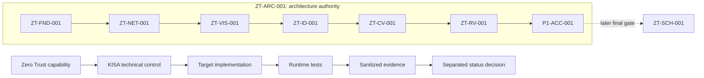

# Zero Trust - KISA 기술통제 매핑

이 디렉터리는 `ZT-GOV-MAP-001`에서 수용된 제로트러스트 역량·패키지·KISA 2026 기술 항목·대상 자산·검증·예외 프레임워크다.

- 원문 메타데이터: `docs/references/kisa-2026-critical-infrastructure-guide.yaml`
- 기계 매핑 권위: `zt-kisa-technical-control-map.yaml`
- 검토용 표현: `zt-kisa-technical-control-map.md`
- 판단 방법: `zt-kisa-mapping-methodology.md`
- 범위와 제한: `zt-kisa-scope-and-limitations.md`
- 엄격 스키마: `schemas/zt-kisa-technical-control-mapping.schema.json`
- 읽기 전용 검증기: `tools/validate_zt_kisa_mapping.py`

프레임워크는 42개 record로 구성된다. 39개는 인증된 원문의 정확한 코드·명칭·중요도·페이지를 갖고, 3개는 CV/RV/SCH용 `GOVERNANCE_ONLY` record로 KISA 코드를 의도적으로 비워 둔다.

모든 KISA item 매핑 상태는 `REFERENCED_ONLY / NOT_VALIDATED / SOURCE_METADATA_ONLY / UNASSESSED / NOT_ASSESSED`다. 패키지 상태는 `docs/zero-trust/package-status.yaml`의 독립 권위이며 이 프레임워크가 구현, 런타임 수용, 성숙도, 컴플라이언스 또는 인증 상태를 승격하지 않는다.

