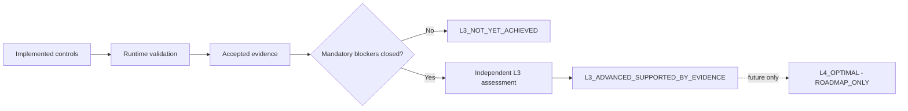

# 성숙도 목표

## 실제 목표

`L3_ADVANCED`는 구현과 검증의 최종 목표이지 현재 상태가 아니다. 현재 프로젝트 성숙도는 `UNASSESSED`이며 이 계획은 성숙도 평가를 수행하지 않는다.

L3 결정은 단순 평균으로 만들 수 없다. 중앙 ID, MFA, federation/OIDC, RBAC, 최소 권한, 분할, 중앙 가시성, 두 개 이상의 서로 다른 환경, 허용·거부·우회·지속성·롤백, 반복·예약 검증, 최신 정제 증적, 예외·잔여 위험과 실제 적용된 Policy as Code 또는 drift가 각각 증거 기반 게이트를 통과해야 한다.

```text
implemented controls -> runtime validation -> accepted evidence
-> mandatory blocker review
   -> blocker open: L3_NOT_YET_ACHIEVED
   -> blockers closed: independent L3 assessment
      -> L3_ADVANCED_SUPPORTED_BY_EVIDENCE
      -> future only: L4_OPTIMAL / ROADMAP_ONLY
```



## L4 경계

L4는 지속 사용자·기기 신뢰평가, 워크로드 위험, 맥락 정책, 행동분석, 실시간 위험점수, 자동 세션 종료·네트워크 격리, 정책 최적화, 전사 거버넌스와 장기 효과지표를 다루는 미래 로드맵이다. 모든 항목은 `ROADMAP_ONLY / NOT_VALIDATED / NOT_CLAIMED`다.

기계 권위는 `maturity-target.yaml`이다.
