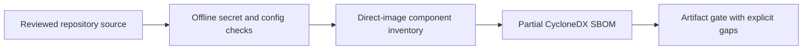
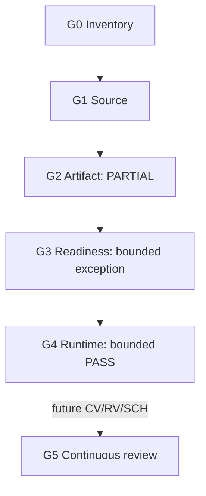
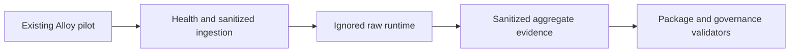

# ZT-APP-001 Secure Workload Foundation

## Scope and pilot

ZT-APP-001 inventories two applications and four workloads, validates a
secure-deployment policy, creates a direct-image partial SBOM, runs offline
secret/configuration scans, and performs bounded runtime health validation.
The existing Alloy sanitized-event collector is the sole live pilot because it
is non-critical, already running, rollback documented, loopback/private, and
observable without deployment or restart. Primary Grafana, OpenStack control
services, EVE-NG control services, and the configuration-only Kubernetes sample
are not pilots.

## Capability and architecture boundary

The direct bounded mappings are `ZT-5.4.1`, `ZT-5.4.2`, `ZT-5.5.1`,
`ZT-5.5.2`, `ZT-5.1.1`, `ZT-7.1`, `ZT-8.1`, and `ZT-8.2`. Current maturity is
`UNASSESSED`. Continuous authorization, remote access, full DevSecOps, RASP,
complete SAST/DAST, production promotion, and enterprise CI/CD are absent.

## Deployment gates

Inventory and source gates pass. Artifact validation remains partial because
digests, signatures, transitive components, and a dedicated vulnerability scan
are absent. Deployment readiness passes with a bounded exception: Alloy uses
container UID 0, while privileged mode is absent, all capabilities are dropped,
new privileges are disabled, root is read-only, and resource limits exist.
Runtime health and sanitized ingestion pass. Continuous review is not
implemented.

## Tooling and evidence

No optional scanner was installed. The dependency-free wrapper executes a
strong-pattern secret scan, Compose policy checks, and direct-image CycloneDX
generation without network access or source modification. Runtime output stays
under `.runtime/zero-trust/application/`; only reviewed inventories, the
partial SBOM, and aggregate evidence are committed.

## Status, limitations, and rollback

Status is `IMPLEMENTED / PARTIALLY_RUNTIME_VALIDATED`; maturity remains
`UNASSESSED`. Image digests, signatures, dedicated vulnerability scanning,
transitive SBOM coverage, non-root compatibility, CI enforcement, and
continuous review remain open. Rollback is documented in
[zt-app-001-rollback.md](zt-app-001-rollback.md).
