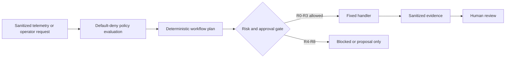
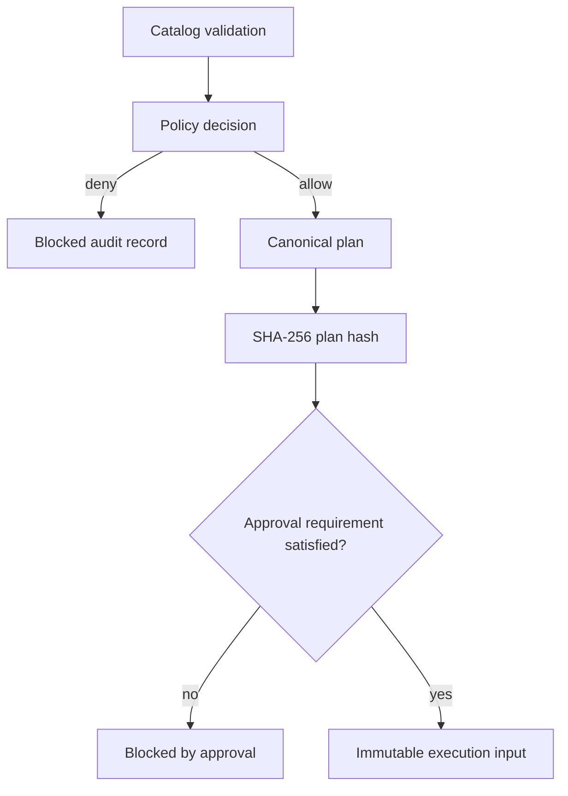
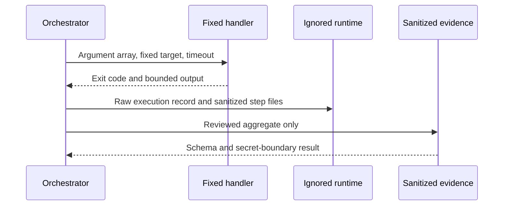
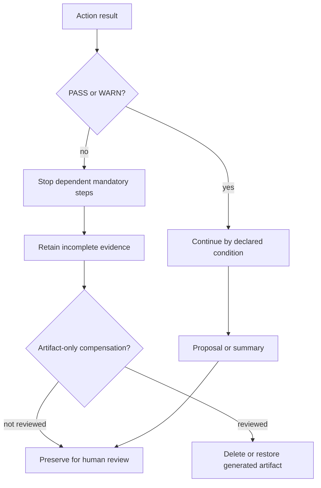

# ZT-AUTO-001 Policy Automation Foundation

## Purpose and accepted scope

ZT-AUTO-001 implements a bounded single-workstation orchestration foundation
for existing repository validators. It registers fixed handlers, evaluates a
default-deny policy, produces an immutable deterministic plan, runs only R0 to
R3 read-only or local-artifact actions, sanitizes evidence, and records every
outcome. It is not a general command runner, remote shell, SOAR platform, or
autonomous response system.

The accepted live result is one `EXECUTE_READ_ONLY` cross-domain workflow with
plan hash `c64b56bfdb0831b91290f051ea385e4c7fefbe53afe665ac340e2545accaba32`.
It returned `PARTIAL`, 4 PASS, 4 WARN, 0 FAIL, and exit code 0. The warnings
retain the accepted predecessor states rather than hiding them.

## Capability boundary

All six canonical automation-integration capabilities come from 제로트러스트
가이드라인 2.0, printed pages 87-89, Table 3-39. ZT-8.1 정책 통합 and
ZT-8.2 중요 프로세스 자동화 receive bounded implementation and partial runtime
evidence. ZT-8.5 데이터 교환 표준화 and ZT-8.6 보안 운영 조정 및 사고 대응 are
reference-only contributions. ZT-8.3 인공지능 and ZT-8.4 보안 통합, 자동화 및
대응 remain gaps. Every source maturity characteristic remains
`SOURCE_DEFINED_NOT_ASSESSED`; package target `INITIAL` is a plan, not a current
maturity assignment.

## Current automation landscape

The inventory records repository, OpenStack, EVE-NG, router, endpoint, system,
telemetry, correlation, policy, workflow, and review-handoff integrations.
Existing fixed local and restricted live validators are reusable. Persistent
Grafana/Loki/Alloy telemetry is live for approved sanitized JSONL. Email,
Slack, webhook, ticketing, GitHub issue, and incident-management delivery are
absent, so notifications and incident handoffs remain local proposals. There
is no suitable existing GitHub Actions validation workflow; this package adds
no CI workflow and no live credential dependency.

## Selected orchestration model

Actions name a reviewed handler ID; YAML cannot supply an executable, remote
target, command, working directory, or command fragment. The Python runner
resolves the handler in code, uses argument arrays with `shell=False`, an
explicit environment allowlist, fixed timeouts, no interactive prompt, and a
repository-root working directory. Positive parameter allowlists reject path
traversal, shell metacharacters, unapproved hosts, aliases, and paths.

## Action, workflow, risk, and approval registries

Thirteen actions cover repository validation, taxonomy sync, system inventory,
configuration drift, service state, restricted live system validation,
telemetry validation, evidence summary, and local governance/review proposals.
Six workflows cover cross-domain validation, evidence handling, deterministic
correlation review, drift review, gap proposal, and incident-review handoff.

R0 is read-only, R1 is local runtime-artifact write, R2 is repository-status
proposal, and R3 is approved remote read-only validation. R4 through R7 are
future change categories requiring stronger approval and cannot execute here;
R8 is prohibited. Committed policy is not human approval. The live R3 path is
allowed only because it reuses previously accepted fixed package policies and
destinations. Proposal-only actions require operator review and never update
authoritative files.

## Restricted execution and evidence

Check and plan modes perform no action. Execute-read-only invokes only fixed
handlers. Proposal-only writes solely under the ignored automation runtime.
Each workflow has one local lock with owner metadata; duplicates are rejected,
stale locks are reported and never silently removed. Actions are bounded by
timeouts. Retry defaults to `NONE`; no approval, policy, schema,
authentication, secret-scan, or change failure is retried.

Child exit codes propagate; mandatory failure is never converted to a warning.
`PASS`, `WARN`, `FAIL`, `SKIPPED`, unavailable, blocked, timed-out, and execution
error states remain distinct. Runtime data, locks, plans, proposals, and raw
execution records remain ignored. The committed evidence is a manually
reviewed aggregate with paths and sensitive values removed.

## Failure, rollback, and human review

Read-only actions need no infrastructure rollback. Generated runtime artifacts
may be removed or restored only through an explicit cleanup decision; failed
workflow evidence is retained as incomplete rather than silently deleted.
Future mutation actions define reference boundaries only and have no handler.

Correlation findings may produce evidence, a plan, a change proposal, or a
review package. They cannot block traffic, isolate an account or workload,
restart a service, modify a firewall or route, rotate a credential, or declare
a confirmed incident. No authoritative baseline, gap, risk, or implementation
record is automatically rewritten.

## Status and remaining gaps

The package is `IMPLEMENTED / PARTIALLY_RUNTIME_VALIDATED`, with current
maturity `UNASSESSED`. It has one partial live cycle, not repeatable or
scheduled evidence. A warning-free integrated run, reviewed external
notification and incident-management channels, time-separated repeatability,
and capability-specific maturity assessment remain open. ZT-CV-001 is the next
package; ZT-RV-001 and ZT-SCH-001 remain later gated work.
