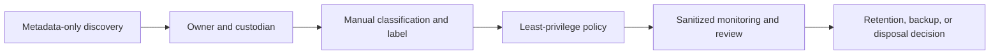
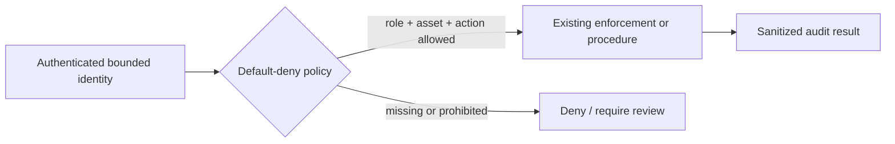
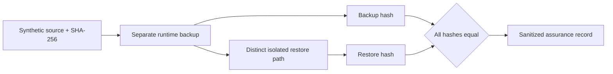
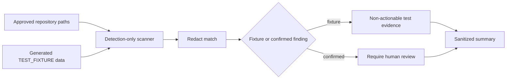

# ZT-DATA-001 Data Protection Foundation

## Purpose and scope

ZT-DATA-001 implements a bounded laboratory inventory, manual classification,
least-privilege policy model, actual-flow map, evidence-based encryption
assessment, key/credential boundary, detection-only DLP scanner, and synthetic
backup/restore assurance. The pilot uses repository-generated evidence,
approved sanitized telemetry metadata, and non-sensitive generated test data.
Personal documents, customer records, credentials, private keys, full runtime
records, and external accounts are excluded.

Status is `IMPLEMENTED` / `PARTIALLY_RUNTIME_VALIDATED`; current maturity is
`UNASSESSED`, with `INITIAL` only a target. No scenario state changes.

## Capability mappings

The bounded contributions map to `ZT-6.1.1`, `ZT-6.2.1`, `ZT-6.3.1`,
`ZT-6.4.1`, `ZT-6.5.1`, `ZT-6.5.2`, `ZT-7.1`, `ZT-8.1`, and `ZT-8.2`.
`ZT-6.1.2` enterprise governance is deliberately not mapped. Each contribution
and limitation is machine-readable in `zt-data-001-package.yaml`.

## Current data landscape and pilot selection

The audit found 1,294 repository files at collection time (107 YAML/YML, 44
JSON, 5 CSV, and 974 Markdown), existing package evidence, an ignored raw
runtime convention, a single-node sanitized telemetry store, and sanitized
OpenStack platform evidence. Backup/restore scripts exist as scenario design or
example material, but no live platform backup/restore acceptance existed.
Restic, rsync, OpenSSL, 7-Zip, Gitleaks, and detect-secrets were absent; tar was
present. No tool was installed.

Seven stable data assets are inventoried: repository governance, sanitized
evidence, ignored raw runtime evidence, sanitized telemetry, OpenStack storage
metadata, a synthetic backup source, and its test artifact. The safe pilot was
selected because it contains no real personal, confidential, authentication,
or production data and can be restored to a distinct ignored path without
overwriting anything.

## Inventory, classification, and governance

`data-inventory.yaml` binds owner, custodian, lifecycle, classification,
access, encryption, backup, monitoring, evidence, and limitation fields.
Labels are `ZTDATA-PUBLIC`, `ZTDATA-INTERNAL`, `ZTDATA-SENSITIVE`,
`ZTDATA-RESTRICTED`, and `ZTDATA-SECRET-REFERENCE`. Assignment is manual;
automatic classification is false. `data-governance-model.md` is explicitly a
laboratory model, not enterprise governance.

## Access-control and data flows

Six default-deny policies permit explicit actions for defined roles. Wildcard
access to sensitive or restricted data is rejected. Identity MFA and device
compliance fields are recorded honestly as not enforced by this package.
Five flows represent current local validator output, sanitization, Alloy-to-
Loki ingestion, synthetic backup, and isolated restore; no planned database or
external cloud flow is invented.

## Encryption and key boundary

Encryption states are evidence-based: Git remote HTTPS is `ENCRYPTED` in
transit; monitoring loopback HTTP and the synthetic backup are
`NOT_ENCRYPTED`; four platform/storage assessments remain `UNKNOWN`; and
encryption in use is `NOT_IMPLEMENTED`. Product names do not imply encryption.
`key-and-credential-management.md` records categories and responsibility only;
no value, rotation, revocation, KMS deployment, or recovery operation occurred.

## Backup and restoration assurance

The validator generated a non-sensitive JSON fixture under the ignored runtime
boundary, recorded its SHA-256, copied it to a separate backup directory,
restored it to a third directory, and verified all hashes. The original path
was not overwritten. The artifact is unencrypted because no approved encryption
tool or key boundary was introduced. Monitoring and OpenStack backup states
remain `UNKNOWN`.

## Detection-only DLP and telemetry

Eleven deterministic detectors cover the required categories. Eight generated
non-functional fixtures were detected, all match values were replaced with
`[REDACTED]`, and confirmed repository findings were zero. Allowed actions are
log, alert, create evidence, and require review. Blocking, deletion,
quarantine, modification, rotation, and external transmission are false.

The telemetry event model now supports data discovery, classification,
access, export, backup/restore, integrity, DLP, encryption, stale-backup, and
unclassified-data events. It forbids values, full records, complete personal
identifiers, tokens, keys, and file contents. Central ingestion of the package
summary is not claimed.

## Validation and evidence workflow

`validate_data_inventory.py` cross-validates asset, owner, classification,
policy, flow, encryption, and backup references. `scan_data_policy.py` scans
approved repository paths only and redacts findings. `validate_backup_assurance.py`
separates creation from restoration and runs the optional synthetic test.
`validate-data-live.ps1` preserves exit codes and writes runtime output only
under `.runtime/zero-trust/data/`. Sanitized authority records are
`zt-data-001-validation.yaml` and `zt-data-001-backup-assurance.yaml`.

## Privacy, rollback, limitations, and gaps

No real sensitive data, credentials, private keys, personal documents, or
external service was used. Source data was not encrypted, deleted, moved,
rewritten, or exported. Rollback removes only package-owned repository files
through reviewed version-control change and leaves ignored runtime cleanup to
the operator; it never touches live sources.

Remaining gaps include automatic discovery/classification, dynamic identity-
and-device-aware access, evidenced platform encryption, centralized key
management, live backup/restore, approved blocking DLP, continuous data-access
analysis, complete rights management, and encryption in use. This package does
not establish enterprise data governance, complete DLP, Advanced/Optimal
maturity, or Phase 1 completion.
