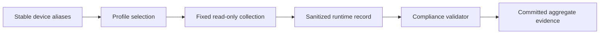
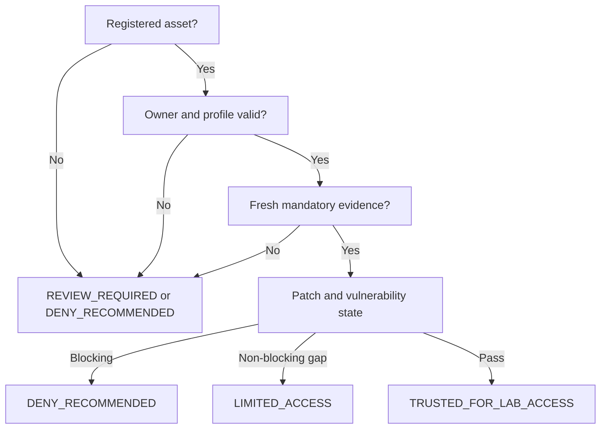
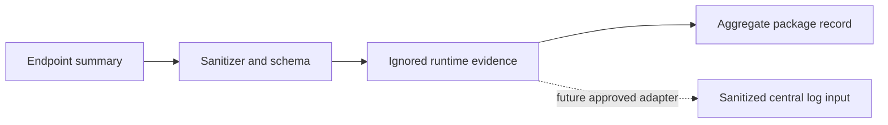

# ZT-DEV-001 Endpoint Compliance Foundation

## Purpose and scope

This package establishes a privacy-minimized inventory, compliance profiles,
read-only software and patch-state collection, a bounded vulnerability proxy,
and deterministic device-trust recommendations for the non-production lab.
It implements no patch, reboot, isolation, or endpoint-agent action.

Six stable asset aliases are classified. The monitoring VM is the sole
mandatory live endpoint pilot. OpenStack, EVE-NG, and the virtual router stay
inside their existing restricted-validator boundaries; the workload VM is
inventory-only and the personal Windows operator environment is excluded.

## Capability mapping

- `ZT-2.3.1` — 기기 인벤토리: bounded implementation and partial runtime validation.
- `ZT-2.1.1` — 기기 감지 및 규정 준수: bounded implementation and partial runtime validation.
- `ZT-2.4.2` — 자산, 취약성 및 패치 관리 자동화: read-only assessment only; automation absent.
- `ZT-2.2.1` — 실시간 검사를 통한 기기 권한 부여: policy design only.
- `ZT-2.3.2` and `ZT-2.4.1`: reference-only; UEM/MDM and EDR/XDR are absent.

## Inventory and assessment flow

## Compliance decision flow

## Software, patch, and vulnerability assessment

The live collector records OS/kernel summaries, installed-package count,
container runtime versions, running-container count, cached security-update
count, reboot-required state, and known agent-service state. It does not
refresh package repositories or collect package names. Native update state is
only a vulnerability proxy; no dedicated scanner or exploit was executed.

The accepted run found three healthy monitoring containers, zero cached
security updates, and a reboot-required marker. The result is
`PARTIALLY_COMPLIANT` with operator-reviewed maintenance open.

## EDR, authorization, and telemetry boundary

EDR/XDR adoption is `DEFERRED`; no agent was installed. Device-trust outcomes
are policy recommendations without enforcement. The endpoint validator emits
sanitized `ENDPOINT_STATE`-compatible summaries to ignored runtime storage;
central ingestion is a later integration step and is not claimed here.

## Validation and evidence

`tools/endpoint/validate_endpoint_compliance.py` validates inventory
uniqueness, ownership, profiles, freshness, patch state, prohibited mutation,
unknown assets, privacy, and agent-installation boundaries. Fifteen positive
and negative regression tests pass. The live package run returned one PASS,
two WARN, zero FAIL, and exit code zero.

## Privacy, maturity, and limitations

No addresses, full MAC addresses, hardware serials, usernames, credentials,
personal application lists, full package lists, or raw host logs are committed.
Current maturity remains `UNASSESSED`. This package does not establish UEM,
MDM, EDR, XDR, real-time authorization, automated patching, broad lab endpoint
coverage, or organization-wide compliance.

Rollback is defined in
[zt-dev-001-rollback.md](zt-dev-001-rollback.md).
