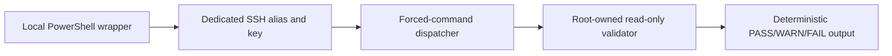
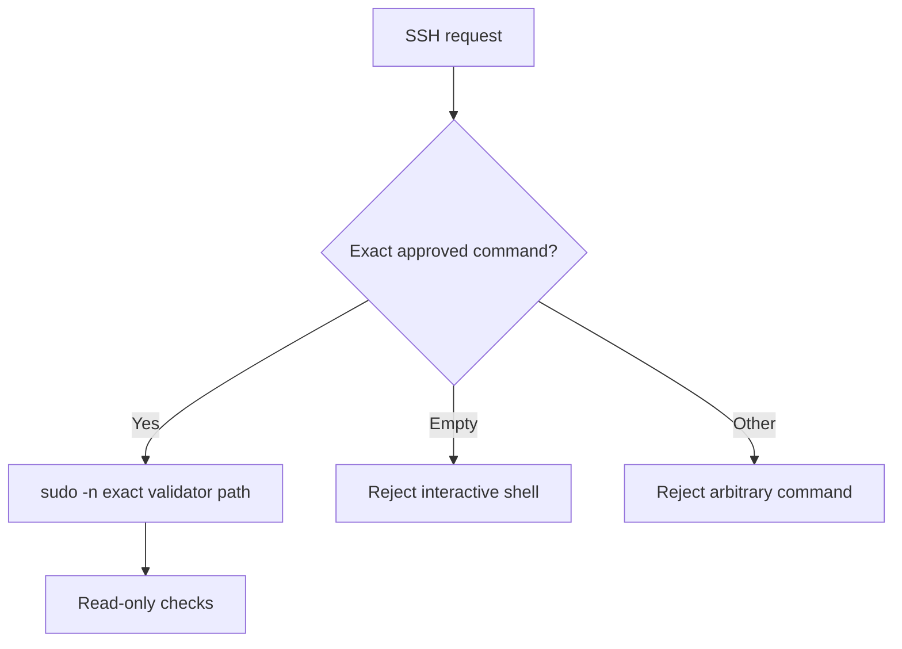
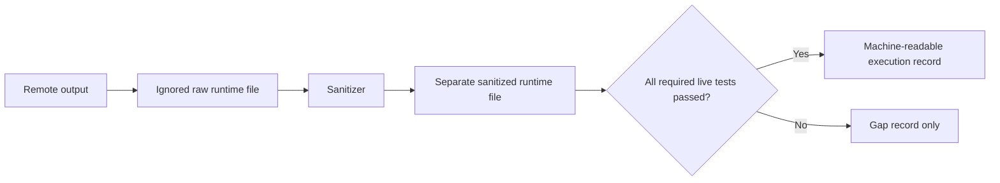

# ZT-FND-001 Restricted Validation and Evidence Foundation

## Package gate

- Package: `ZT-FND-001`
- Authorization: explicitly approved by the repository operator
- Implementation status: `IMPLEMENTED`
- Validation status: `VALIDATED`
- Current maturity: `UNASSESSED`
- Maximum target maturity: `INITIAL`
- Runtime evidence authority: `CODEX_EXECUTED_LIVE_RUNTIME`

The local wrappers, sanitizer, remote templates, and governance checks exist. The OpenStack restricted endpoint completed 50 read-only checks with 0 warnings and 0 failures. The EVE-NG restricted endpoint completed 42 checks with 0 warnings and 0 failures. Both endpoints rejected interactive, arbitrary, and sensitive-read requests. The package is validated for the bounded non-production lab.

## Purpose

This package defines a least-privilege, repeatable path for read-only validation of the OpenStack AIO and EVE-NG hosts. It separates operator administration from Codex validation, rejects interactive or arbitrary remote commands, keeps raw output outside Git, and permits status changes only after successful live validation.

## Capability mappings

The package is conservatively mapped to the canonical catalog entries below:

- `ZT-1.4.2` — least-privilege access
- `ZT-4.1.1` — system access control
- `ZT-4.2.2` — credential management
- `ZT-7.1` — recording relevant activities
- `ZT-8.2` — critical-process automation
- `ZT-8.5` — standardized data exchange

These mappings describe intended package coverage. They do not advance capability implementation, validation, evidence, or maturity state without accepted runtime evidence.

## Trust assumptions removed

- A validator does not need an unrestricted administrative shell.
- A validator does not need a general-purpose sudo rule.
- A validator does not choose remote commands or command arguments.
- Raw runtime output is not repository evidence.
- The existence of scripts is not proof that a remote control is installed or effective.

## Architecture

### Local-to-remote validation flow



### Forced-command authorization path



### Evidence flow



## Components

Local components:

- `tools/live-validation/validate-openstack-live.ps1`
- `tools/live-validation/validate-eve-live.ps1`
- `tools/live-validation/run-foundation-validation.ps1`
- `tools/live-validation/sanitize-live-evidence.py`
- ignored runtime root `.runtime/zero-trust/`

Remote installation templates:

- `tools/openstack-validator/codex-openstack-dispatcher.sh.example`
- `tools/openstack-validator/validate-openstack-readonly.sh.example`
- `tools/live-validation/remote/codex-eve-dispatcher.sh.example`
- `tools/live-validation/remote/validate-eve-readonly.sh.example`

The templates are not installation evidence. Installed remote copies must be root-owned, mode `0755`, syntax checked, and exposed only through exact-command sudo and forced-key restrictions.

## Policy and credential boundaries

The only intended remote commands are:

```text
ssh -o BatchMode=yes openstack-validator validate-all
ssh -o BatchMode=yes eve-validator validate-host
```

Dedicated private keys remain outside the repository. Authorized keys must use `command=`, `no-agent-forwarding`, `no-port-forwarding`, `no-pty`, `no-user-rc`, and `no-X11-forwarding`. Operator access must remain intact until every restricted endpoint and boundary test passes.

Operator and validator access are separate. `openstack-operator` and `eve-operator` use different host-specific keys outside the repository. Validator aliases use different forced-command keys. Operator break-glass passwords must be unique per host, stored only in an external password manager, and never reused or committed.

## Validation and evidence workflow

1. Confirm the dedicated key and effective alias outside the repository.
2. Install the reviewed dispatcher, validator, and exact sudoers entry through an existing operator channel.
3. Run syntax, ownership, permission, and `visudo -cf` checks remotely.
4. Run the approved command through `BatchMode`.
5. Test empty-command, harmless arbitrary-command, and sensitive-read rejection.
6. Keep raw output only under `.runtime/zero-trust/`.
7. Sanitize to a separate file.
8. Create an execution record only when real execution and required boundary tests succeed.

## Current audit result

The OpenStack alias points to a dedicated restricted account and dedicated external key. Its allowed command returned 50 PASS, 0 WARN, 0 FAIL, and exit 0 on 2026-07-17. Interactive and harmless arbitrary requests returned the expected denial and non-zero exit. The repository's sanitized 2026-07-16 endpoint evidence records the credential-read denial and the exact forced-command controls.

The EVE endpoint now uses a dedicated external key, the `codex-validator` account, a root-owned forced-command dispatcher, a root-owned read-only validator, and an exact sudoers rule. It returned 42 PASS, 0 WARN, 0 FAIL and rejected empty, arbitrary, and configuration-read requests. The prior operator key and operator access were preserved.

## Restrictions

- No interactive shell, arbitrary command, broad sudo, password automation, or key material in Git.
- No cloud, network, VM, container, service, interface, route, firewall, or lab mutation.
- No Cisco router validation in this package.
- No successful runtime claim without a generated execution record.
- No `ADVANCED` or `OPTIMAL` maturity claim.

## Known limitations and remaining gaps

- This is a bounded laboratory control, not enterprise PAM, continuous authentication, or complete identity lifecycle management.
- The package does not assign capability maturity; current maturity remains `UNASSESSED`.

Rollback is documented in [ZT-FND-001 rollback](zt-fnd-001-rollback.md).
