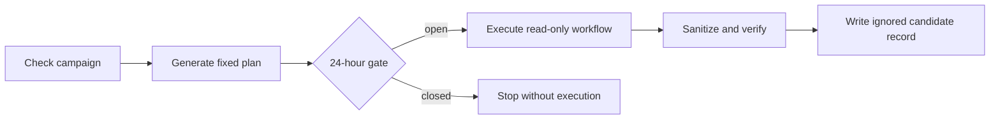
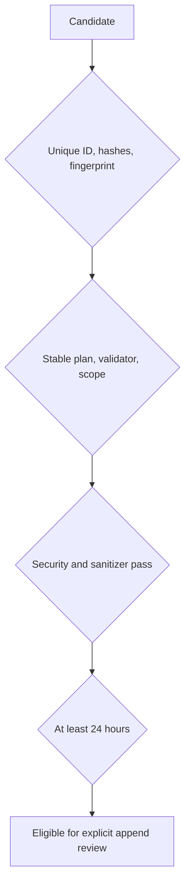
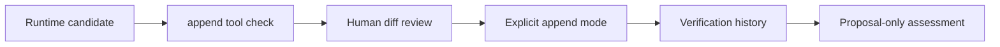
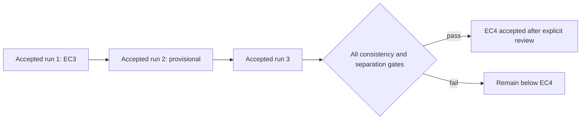

# ZT-RV-001 Repeatable Runtime Validation Pilot

## Purpose and scope

This package implements one manual evidence-continuity campaign for
`ZT-4.1.1` 접근통제. The selected `ZTCV-VAL-SYS` validator runs only through
the fixed `ZT-CV-WF-001` read-only workflow at the unchanged seven-system lab
scope. `ZT-8.1`, `ZT-8.2`, `ZT-7.1`, and `ZT-3.1.1` were rejected for this
campaign because they are lower in the current overlay or blur EC4 with
automation or EC6 objectives.

The inherited capability evidence is EC3. The campaign requires three unique,
consecutive, sanitized successes at least 24 hours apart, with a stable plan,
validator version, target-scope fingerprint, and zero blocking failures. Five
known warning categories may remain visible. Duplicate IDs, evidence hashes,
or fingerprints never increase continuity.

## Campaign execution flow

## Independence validation

The target fingerprint includes only safe architecture identifiers. Validator
tracking uses an explicit version plus the normalized file SHA-256. The
execution fingerprint includes campaign and plan identities, the sanitized
result hash, and timestamp; it is not a digital signature.

## History and assessment flow

The live wrapper never appends history. The append tool may change only the
verification history and requires an explicit approval reference. Assessment
outputs stay under ignored runtime paths and never update baseline, acceptance,
gap, or maturity authorities automatically.

## EC3-to-EC4 boundary

The campaign completed three reviewed successes at
`2026-07-28T08:28:25.829099Z`, `2026-07-30T00:28:34.120022Z`, and
`2026-08-01T23:00:20.110724Z`. The accepted result is bounded EC4 for the
selected fixed campaign.

No schedule is installed. EC5, EC6, EC7, maturity promotion, automatic retry,
remediation, mutation, commit, and push remain outside this package. The
historical first-run gate at `2026-07-23T04:57:52.159854Z` preserved separation
from the accepted CV baseline; later intervals also exceeded 24 hours.
