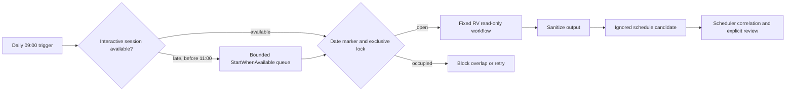

# ZT-SCH-001 Scheduled Validation Package

## Bounded objective

ZT-SCH-001 schedules the already accepted fixed `ZT-RV-001` read-only
validation workflow. It adds scheduler provenance, one-attempt-per-day and
exclusive locks, a 20-minute outer timeout, failure and missed-run detection,
freshness assessment, sanitized ignored evidence, and explicit disable and
removal paths.

The approved Windows Task Scheduler definition is installed and runs daily at 09:00 local time
(`Asia/Seoul` / `Korea Standard Time`) as the current user with a limited
interactive token. It stores no credential. The user session and lab targets
must be available by the end of the bounded 09:00-11:00 catch-up window. The
job never starts, stops, repairs, or reconfigures infrastructure.

## Execution boundary

`StartWhenAvailable` is enabled only for the same local date's two-hour window.
The runner rejects execution before 09:00 or after 11:00 without consuming an
attempt. Automatic retry, remediation, infrastructure mutation, repository
mutation, history append, maturity update, and Phase 1 completion remain
disabled. A failed or unavailable target within the window creates a failed
candidate and consumes that local date's single attempt.

## Evidence and acceptance

Runtime output remains under `.runtime/zero-trust/scheduled-validation/`.
Scheduler provenance is not trusted from a command-line flag alone. A candidate
must be correlated with the registered task's last-run metadata and reviewed
before sanitized evidence or verification history can become authoritative.
The correlation tool first performs a read-only bounded-window,
exit-code, definition-fingerprint, and post-run status check. Writing an ignored
correlation record requires a separate bounded review reference and still does
not update tracked verification history.

EC5 requires successful correlated executions on the latest three due scheduled
dates. Historical failure and missed-date findings remain visible but are
recoverable after a new three-date accepted window. Installation or a manually
started scheduler test does not meet that threshold. Until the threshold and
explicit review are complete, Phase 1
remains `PARTIAL / PARTIALLY_VALIDATED / NOT_COMPLETE` at `ZT-SCH-001`.

## Installation and rollback boundary

`manage-scheduled-validation.ps1 -Mode Install` used an explicit bounded
installation approval reference and did not replace a divergent task. Repeated
install finalization is allowed only when the existing definition matches
exactly. `-Mode Update` permits only the reviewed disabled-to-bounded-catch-up
migration and requires its own explicit approval reference. Status is read-only.
Disable and uninstall each require their own
explicit approval reference. Both rollback paths preserve ignored runtime
evidence; neither changes Git or other infrastructure.
