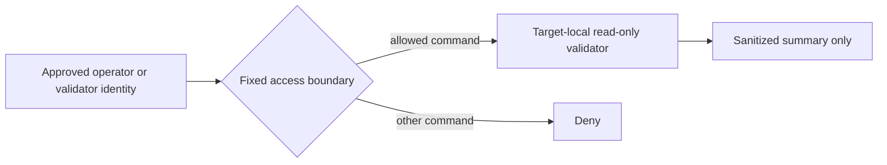
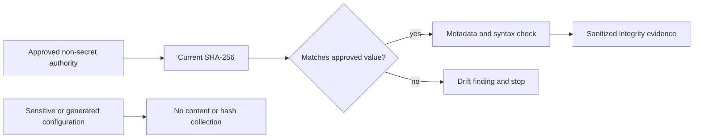
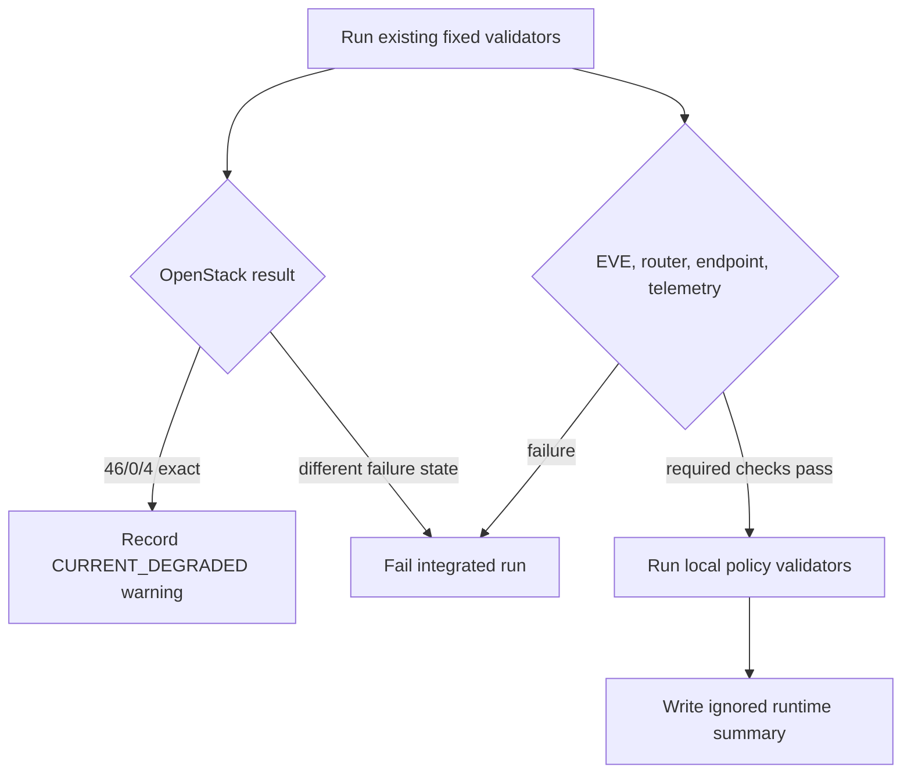

# ZT-SYS-001 System Security Foundation

## Purpose and scope

ZT-SYS-001 establishes a bounded laboratory system inventory, baseline-policy
model, configuration authority, integrity comparison, privileged-access
boundary, credential-reference inventory, service/exposure policy, change
control, risk register, and recovery-readiness assessment. It reuses only the
existing fixed read-only OpenStack, EVE-NG, router, monitoring endpoint, and
persistent-telemetry validators.

The package status is `IMPLEMENTED` / `PARTIALLY_RUNTIME_VALIDATED`. Current
maturity remains `UNASSESSED`; `INITIAL` is a target only. It did not install
software, restart a service, modify a target configuration, perform recovery,
or change scenario scope.

## Capability mappings

The bounded contribution maps to `ZT-4.1.1`, `ZT-4.2.1`, `ZT-4.2.2`,
`ZT-4.3.1`, `ZT-4.4.1`, `ZT-7.1`, `ZT-8.1`, and `ZT-8.2`. The package record
states the limitation of every mapping. References do not establish complete
PAM, credential lifecycle management, system-wide hardening, or maturity.

## System landscape and authority

Seven stable records cover the OpenStack AIO, EVE-NG host, virtual Cisco
router, monitoring Linux VM, Grafana/Loki/Alloy platform, repository validation
workstation boundary, and restricted validation plane. Six baseline profiles
distinguish operating-system, platform, appliance, and validation boundaries.
Collection excludes secret values, complete configurations, complete address
or port inventories, hardware identifiers, unrelated systems, and personal
workstation activity.

## Privileged access and credential boundary

The privileged-access model records operator, restricted-validator, and
service-account responsibilities without recording credential values. Existing
forced-command, exact-sudo, no-PTY, and no-forwarding boundaries are reused.
The package neither creates an unrestricted administrative path nor claims
centralized PAM, session recording, MFA coverage, credential rotation, or a
production vault.

## Configuration integrity and change control

Five safe repository authorities are compared by SHA-256 and matched to
current syntax/metadata evidence. The deployed restricted-endpoint record is
behavior-and-metadata only. Kolla-generated secret-bearing configuration is
not assessed. Neither is hashed. This is point-in-time configuration integrity,
not continuous file-integrity monitoring. Drift creates a finding and requires
review; automatic restoration is prohibited.

## Live service state

EVE-NG passed 42/0/0. The router passed 38 checks with one idle-NAT warning.
Grafana, Loki, and Alloy passed health, retention, ingestion, and query checks.
The monitoring endpoint passed with the already-recorded reboot-required and
missing-agent warnings. OpenStack APIs and containers remained available, but
four test-instance console/connectivity checks failed; this exact 46/0/4 state
is `CURRENT_DEGRADED`. The integrated wrapper accepts only that exact known
baseline and fails on divergence. No automatic remediation was attempted.

## Recovery readiness and limitations

Recovery records distinguish configuration references, backup evidence,
procedure definitions, partial access recovery, and actual system restore.
No system is promoted to full restore validation by this package. OpenStack
recovery, monitoring persistent-volume recovery, EVE host restore, router
image lifecycle, and workstation recovery remain gaps. Service restart,
automatic rollback, and live restore require a separately approved operation.

Remaining gaps include complete system-account lifecycle management, PAM/MFA,
continuous FIM, automated vulnerability management, complete OS/platform
hardening, configuration deployment verification for sensitive host-local
files, central system-event ingestion, and tested recovery. The package does
not establish full compliance, enterprise coverage, Advanced or Optimal
maturity, or Phase 1 completion.
