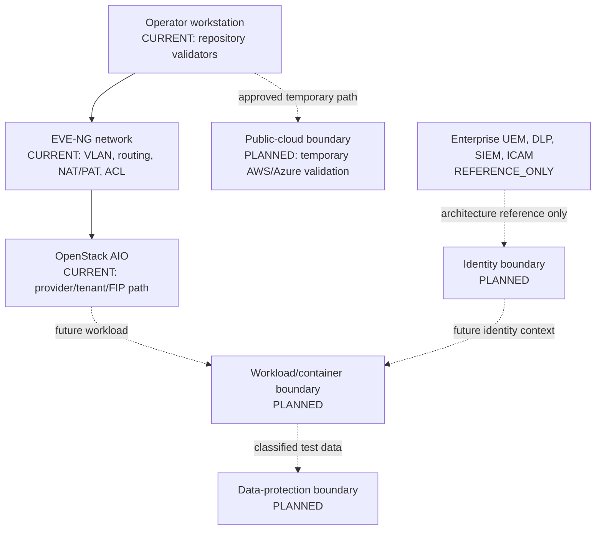
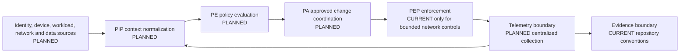
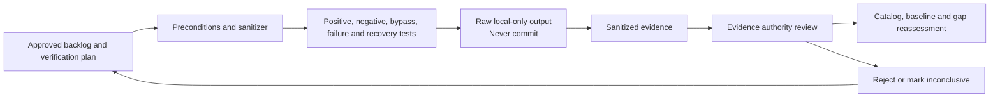
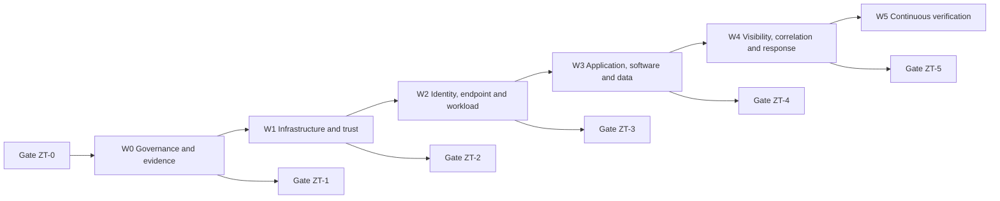

# Zero Trust Reference Laboratory Architecture

This reference architecture distinguishes observed components from planned and reference-only boundaries. A diagram node labelled PLANNED or REFERENCE_ONLY is not implementation evidence.

## Status legend

- **CURRENT:** supported by accepted repository or sanitized runtime evidence.
- **PLANNED:** included in the approved backlog but not yet accepted as implemented.
- **REFERENCE_ONLY:** describes an enterprise dependency the laboratory cannot honestly reproduce.

## 1. Physical and virtual lab boundaries

The operator workstation is the current governance/validation plane. It must not store cloud credentials, state, kubeconfig, raw traffic, or VM disks in the synchronized repository.

## 2. Policy and telemetry flow

This is a **CONCEPTUAL ALIGNMENT**. Current network enforcement is not a complete PDP/PA/PEP implementation.

## 3. Validation and evidence flow

The evidence boundary stores sanitized text and approved configuration extracts only. Secrets, unique identifiers, state, keys, certificates with private material, raw packet captures, and unsanitized output are prohibited.

## 4. Implementation-wave overlay

Wave progression is dependency- and evidence-gated, not calendar-driven. A later wave may be designed while an earlier wave is incomplete, but it must not be accepted or represented as operating.

## Boundary responsibilities

| Boundary | Intended responsibility | Status |
|---|---|---|
| Operator workstation | Governance, local validation, sanitized evidence acceptance | CURRENT, bounded |
| EVE-NG | Network zones and controlled flow enforcement | CURRENT, bounded |
| OpenStack | Private-cloud network/workload substrate | CURRENT network path; workload controls PLANNED |
| Public cloud | Temporary provider validation | PLANNED |
| Workload/container | Application identity, admission, authorization, runtime state | PLANNED |
| Identity | Inventory, authentication, MFA, roles, session context | PLANNED |
| Policy | Context normalization, decision, approved administration | PLANNED |
| Telemetry | Normalized events, health, correlation | PLANNED |
| Evidence | Sanitization, acceptance, traceability, reassessment | CURRENT conventions; continuous evidence PLANNED |
| Automation | Approval-gated change and rollback | PLANNED |
| Data protection | Synthetic data inventory, labels, access, encryption, recovery | PLANNED |
| Enterprise services | ICAM, UEM/MDM, EDR/XDR, DLP, SIEM, threat intelligence | REFERENCE_ONLY |
