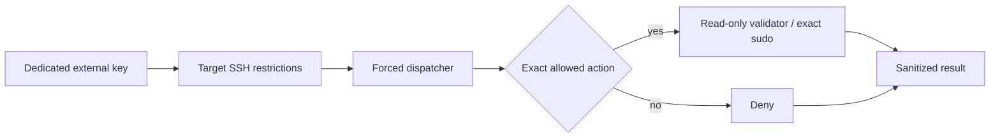

# ZT-SYS-001 Privileged-Access Boundary

This is a bounded laboratory access model, not complete PAM. Operator accounts
remain distinct from dedicated `openstack-validator`, `eve-validator`, and
router-validator identities. Validators use separate external SSH keys,
forced commands, no interactive shell/PTY/forwarding, exact sudo allowlists,
and sanitized execution evidence. Service identities remain non-interactive.

Operator and administrative access is preserved for recovery and requires the
system owner. Access-affecting changes require explicit approval, independent
operator/console recovery, pre-change backup, syntax checks, automatic rollback
where previously approved, positive/negative tests, and post-change review.
Root access is not converted or removed by this package.

Credential values stay outside Git. Session evidence records identity class,
approved action, timestamp, result, and sanitized target class only. Revocation
is target-local and must preserve independent recovery. Periodic access review
remains on-demand until a scheduled package is installed and validated.

Break-glass authority is an owner-controlled reference outside the repository,
time-bounded and logged when used. No password, token, private key, MFA seed,
recovery code, full fingerprint, or personal account inventory is recorded.
