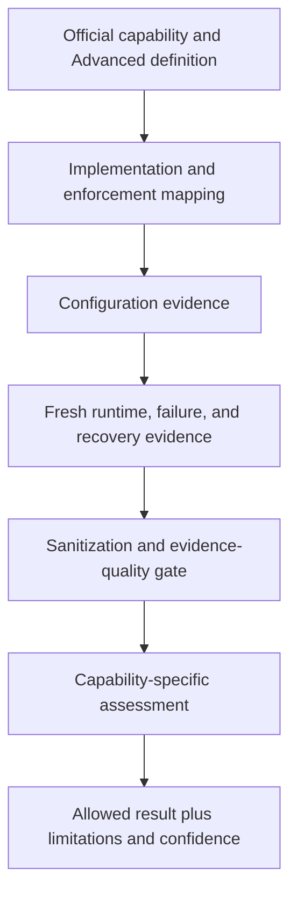

# Advanced Maturity Acceptance Model

Every `ADVANCED_VALIDATED` decision requires the official capability definition and Advanced-stage source reference, implementation mapping, configuration evidence, runtime evidence, enforcement evidence where applicable, repeatability and freshness, a failure test, rollback or recovery, limitations, confidence, and assessor rationale.

Allowed results are `ADVANCED_VALIDATED`, `ADVANCED_PARTIALLY_SUPPORTED`, `INITIAL_VALIDATED`, `DESIGN_ONLY`, `UNASSESSED`, `NOT_APPLICABLE`, and `BLOCKED`. All architecture entries currently remain `DESIGN_ONLY`.

Evidence authorities are `DESIGN_ONLY`, `CONFIGURATION_ONLY`, `CODEX_EXECUTED_LOCAL`, `CODEX_EXECUTED_LIVE_RUNTIME`, `USER_EXECUTED_RUNTIME`, and `MISSING`. Tracked evidence must be sanitized; raw runtime output stays under `.runtime/zero-trust/`.

Architecture diagrams, documentation, product installation, container state, or a single successful health check are insufficient. See `advanced-maturity-acceptance-model.yaml`.
