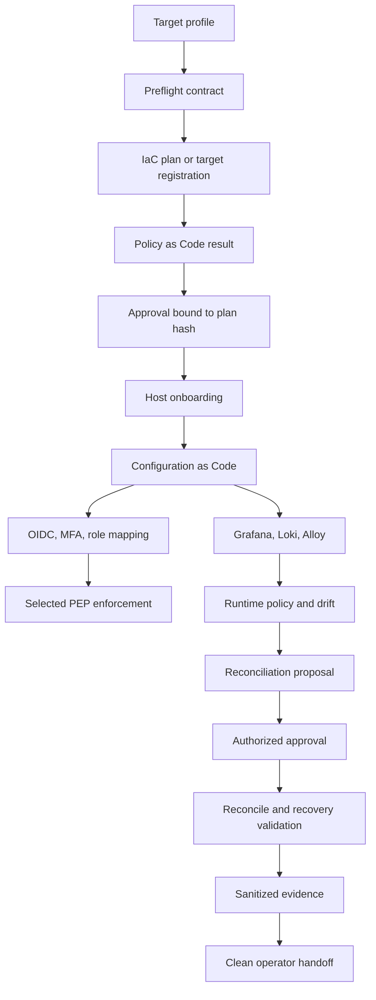
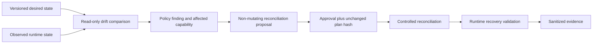

# Authoritative Golden Path

1. Select a target profile.
2. Validate the target.
3. Generate infrastructure desired state.
4. Evaluate the infrastructure plan with Policy as Code.
5. Provision or register the approved target.
6. Configure the OS and services through Configuration as Code.
7. Evaluate rendered service configuration.
8. Start monitoring and identity services through an approved package.
9. Protect Grafana with Keycloak OIDC, MFA, and role mapping.
10. Collect service and access-decision telemetry through Alloy and Loki.
11. Validate access control and service state.
12. Detect a controlled policy violation or drift.
13. Generate a reconciliation proposal.
14. Obtain authorized approval.
15. Reconcile desired state.
16. Validate recovery.
17. Generate sanitized evidence and runbook records.
18. Repeat with a clean operator from documentation.

## Drift and Reconciliation

The Golden Path is a target. Keycloak and additional monitoring components are not deployed by this task.
