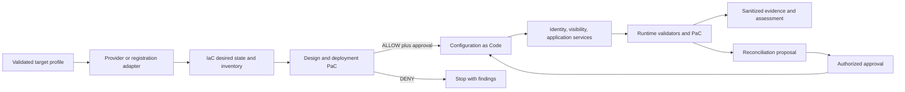
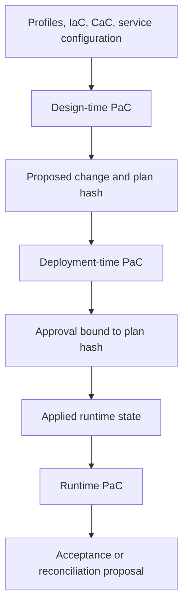
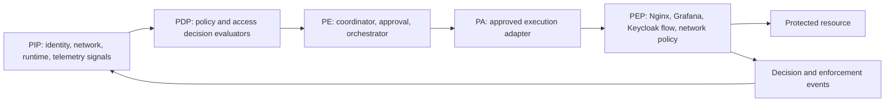

# IaC, Configuration as Code, and Policy as Code Reference Architecture

## Terms and Responsibility Boundary

- Infrastructure as Code (IaC) owns provider-backed desired infrastructure and generated inventory.
- Configuration as Code (CaC) owns versioned operating-system and service configuration. CaC means Configuration as Code, not Compliance as Code.
- Policy as Code (PaC) owns deterministic allow, deny, review, and evidence-quality decisions across design, deployment, and runtime.

IaC does not create an existing VM or physical hardware. CaC does not store real secrets. PaC does not mutate state automatically in this architecture task. Raw runtime state stays outside Git.



## IaC

The OpenStack path may manage network, subnet, router, security group, port, VM, volume, metadata, role tags, and generated inventory. The existing-VM and physical-server paths validate and register targets, then hand off to common onboarding. AWS, Azure, Kubernetes, additional OpenStack adapters remain `ROADMAP_ONLY`.

## Configuration as Code

Reusable roles cover the OS baseline, approved packages, Docker Engine, Buildx, Compose, firewall, directories, ownership, permissions, service accounts, Grafana, Loki, Alloy, Keycloak, MariaDB, Nginx, internal HTTPS, OIDC and MFA policy structure, logging, validators, backup, and recovery. Environment variables, templates, generated configuration, VM-local secrets, and runtime state remain separated. Roles must be version-pinned, idempotent where technically possible, rollback-aware, and validation-aware.

## Policy as Code



Default behavior is `DENY_BY_DEFAULT_FOR_UNREGISTERED_CHANGE`. Policy examples deny protected-service Floating IPs, public management ports, unrestricted SSH, management access from any source, floating image tags, privileged containers, host networking, Docker socket mounts, plaintext repository secrets, wildcard OIDC redirects, administrator access without MFA, missing required health checks, missing rollback, unsanitized evidence, and unauthorized scenario expansion beyond the locked set.

## PDP, PIP, PE, PA, and PEP



Current mappings are limited to existing validators, bounded telemetry, and network observations. Keycloak, Nginx application enforcement, and broader PEPs are planned or future; diagrams do not establish implementation.

| Logical role | Component mapping | State |
|---|---|---|
| PIP | OpenStack runtime state, system validators, network zone, bounded validator telemetry | CURRENT |
| PIP | Keycloak attributes, authentication strength, Alloy, Loki, Grafana access events | PLANNED |
| PDP | deterministic Policy as Code evaluator | PLANNED |
| PDP | continuous risk-aware access evaluator | FUTURE_OPTIMAL |
| PE | approval workflow and automation orchestrator | PLANNED |
| PA | approved configuration and enforcement adapters | PLANNED |
| PEP | selected current network policy boundary | CURRENT |
| PEP | Nginx, protected Grafana, and Keycloak authentication flow | PLANNED |
| PEP | adaptive multi-resource gateways | FUTURE_OPTIMAL |

## Trust Signals and Event Contract

Signals cover identity, authentication strength, role, group, service account, network zone, source network, device identity and posture, system health, application criticality, resource sensitivity, recent behavior, active incident, telemetry freshness, and policy version. Each signal is classified `IMPLEMENTED_SIGNAL`, `STATIC_SIGNAL`, `PARTIALLY_VALIDATED_SIGNAL`, `FUTURE_SIGNAL`, or `UNAVAILABLE_SIGNAL`.

| Trust signal | Current architecture classification | Boundary |
|---|---|---|
| identity | PARTIALLY_VALIDATED_SIGNAL | restricted validator and OpenStack identity observations only |
| authentication_strength | UNAVAILABLE_SIGNAL | MFA is not deployed |
| role | STATIC_SIGNAL | fixed aliases and planned role mappings |
| group | UNAVAILABLE_SIGNAL | centralized group source is not deployed |
| service_account | STATIC_SIGNAL | bounded validator accounts only |
| network_zone | IMPLEMENTED_SIGNAL | bounded VLAN and provider-path evidence |
| source_network | PARTIALLY_VALIDATED_SIGNAL | selected routing and validator observations |
| device_identity | STATIC_SIGNAL | declared inventory identity only |
| device_posture | UNAVAILABLE_SIGNAL | no endpoint posture platform |
| system_health | PARTIALLY_VALIDATED_SIGNAL | selected validators, not continuous coverage |
| application_criticality | STATIC_SIGNAL | profile metadata only |
| resource_sensitivity | STATIC_SIGNAL | profile and policy metadata only |
| recent_behavior | FUTURE_SIGNAL | no behavior analytics |
| active_incident | STATIC_SIGNAL | operator-declared context only |
| telemetry_freshness | PARTIALLY_VALIDATED_SIGNAL | bounded timestamp checks and single-node persistent sanitized storage; no continuous acceptance |
| policy_version | STATIC_SIGNAL | versioned policy metadata target |

The common event contains event ID, timestamp, source, subject, resource, action, result, identity, authentication strength, network/device/system/application/data context, trust score, risk level, policy ID/version, decision, enforcement point/result, correlation ID, and safe evidence reference. Advanced operation may omit or statically set trust score, use deterministic risk, and use rule-based correlation. Dynamic risk remains future Optimal scope.

```yaml
event:
  event_id: "<opaque-event-id>"
  timestamp: "<UTC-timestamp>"
  source: "<registered-source>"
  subject: "<sanitized-subject>"
  resource: "<sanitized-resource>"
  action: "<action>"
  result: "<result>"
  identity: "<sanitized-identity-or-absent>"
  authentication_strength: "<static-or-absent>"
  network_context: {}
  device_context: {}
  system_context: {}
  application_context: {}
  data_context: {}
  trust_score: null
  risk_level: "<deterministic-or-absent>"
  policy_id: "<policy-id>"
  policy_version: "<version>"
  decision: "<ALLOW-DENY-REVIEW>"
  enforcement_point: "<registered-pep>"
  enforcement_result: "<result>"
  correlation_id: "<opaque-correlation-id>"
  evidence_reference: "<safe-relative-path>"
```
