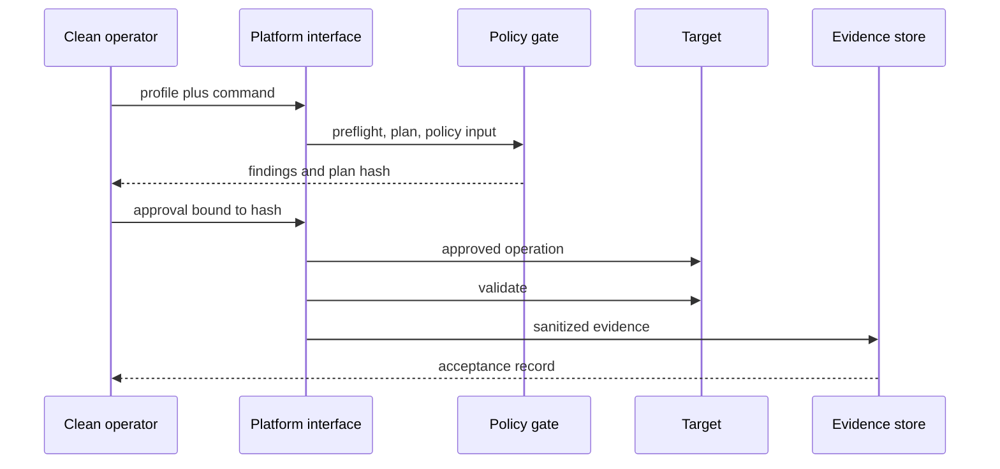

# Unified Operator Interface Contract

Future entry points are `platform.ps1` and `platform.sh`. They are not created in this architecture package because non-functional executables would be misleading.

| Command | Purpose | Mode | Approval | Rollback behavior |
|---|---|---|---|---|
| init | create local working context | mutating | no | none |
| preflight | validate profile and host contract | read-only | no | none |
| plan | render desired change and plan hash | read-only | no | none |
| policy-check | evaluate design and deployment policy | read-only | no | none |
| deploy | apply approved desired state | mutating | yes | rollback |
| validate | run local and runtime validators | read-only | as required | none |
| status | summarize current declared and observed state | read-only | no | none |
| drift-check | compare desired and observed state | read-only | no | none |
| reconcile | apply an approved reconciliation proposal | mutating | yes | rollback |
| backup | create approved recoverable state | mutating | yes | restore test |
| restore | restore approved backup | mutating | yes | rollback |
| rollback | return to accepted previous state | mutating | yes | forward recovery |
| upgrade | apply version-pinned upgrade plan | mutating | yes | rollback |
| rotate-secrets | rotate externally supplied secrets | mutating | yes | revert or reissue |
| rotate-certificates | rotate approved certificates | mutating | yes | restore previous cert |
| decommission | remove target from service and inventory | destructive | yes | restore from retained backup if approved |

## Per-Command I/O, Evidence, and Failure Contract

| Command | Required inputs | Expected output | Evidence output | Failure behavior | Supported targets |
|---|---|---|---|---|---|
| init | profile template, operation ID | initialized local context | initialization manifest | remove incomplete context | all |
| preflight | completed profile, access alias | onboarding state and findings | preflight result | deny plan/deploy on NOT_READY or BLOCKED | all |
| plan | validated profile, desired version | plan, affected capabilities, plan hash | sanitized plan summary | make no change; return failing adapter | all |
| policy-check | source, plan hash, policy version | ALLOW, DENY, or REVIEW_REQUIRED | policy decision record | DENY blocks deployment | all |
| deploy | approved unchanged plan, external secrets | applied-change summary | deployment and configuration versions | stop, preserve failure boundary, invoke approved rollback | declared adapter |
| validate | target, validator version, evidence authority | counters and acceptance blockers | sanitized validation record | acceptance remains blocked | all |
| status | profile and target reference | desired/observed/accepted status | optional sanitized status snapshot | return UNKNOWN without mutation | all |
| drift-check | desired version and observed-state authority | drift set and affected capabilities | drift finding | propose only; do not reconcile | all |
| reconcile | approved proposal and unchanged hash | reconciliation result | proposal, approval, and validation record | stop and execute approved rollback | all |
| backup | backup policy and approval | backup reference and integrity result | sanitized backup manifest | mark backup unusable | all configured services |
| restore | approved backup reference | restore and service-health result | restore validation record | stop and preserve last recoverable state | all configured services |
| rollback | accepted prior version and approval | rollback and recovery result | rollback validation record | escalate to forward recovery | all |
| upgrade | pinned versions, plan, approval | version and migration result | upgrade and rollback-test record | roll back to accepted version | all configured services |
| rotate-secrets | external secret source and approval | rotation result without secret values | identifier-free rotation record | revert or reissue through external source | all configured services |
| rotate-certificates | certificate source and approval | certificate-health result | sanitized validity and chain result | restore accepted certificate | all TLS services |
| decommission | target, retention plan, explicit approval | removal and retained-evidence result | decommission record | stop before irreversible boundary; restore only if approved | declared target |

Each command accepts a target profile, operation ID, and optional approved plan reference; returns structured status, findings, plan hash, affected capabilities, evidence paths, and stop reason; and fails closed. Supported target types are OpenStack VM, existing VM, and physical server unless a command declares a narrower adapter.

Required sequence: `init -> preflight -> plan -> policy-check -> approval -> deploy -> validate -> evidence`.

Preflight failure blocks progression. Policy `DENY` blocks deployment. A changed plan hash invalidates approval. Validation failure blocks acceptance. Sanitization failure blocks tracked evidence. Destructive operations need explicit approval. Repetition must not create unintended change.

