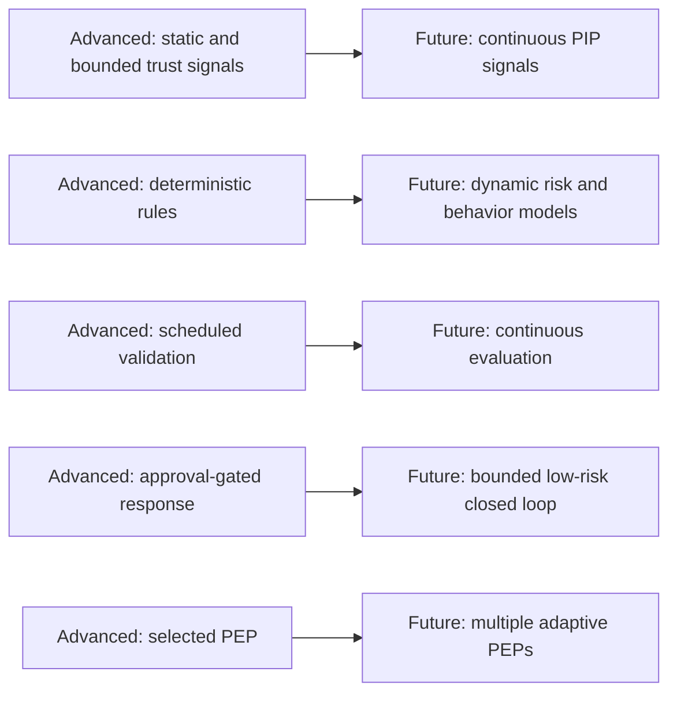

# Optimal-Readiness Architecture

`OPTIMAL_READY` means stable extension interfaces exist; it is not an official maturity level and never replaces `OPTIMAL`.

Extension interfaces cover continuous trust, near-real-time risk, behavior analytics, threat intelligence, endpoint posture, dynamic decisions, continuous application and system authorization, dynamic network enforcement, adaptive MFA, bounded low-risk automated response, continuous effectiveness measurement, and maturity feedback.

All future components remain `NOT_STARTED`, `UNASSESSED`, and `ROADMAP_ONLY`.
