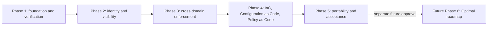

# Authoritative Phase Roadmap

| Phase | Name | Current state | Packages |
|---|---|---|---|
| PHASE_1 | Foundation and Verification Operations | PARTIALLY_VALIDATED | Actual: ZT-FND-001, ZT-NET-001, ZT-VIS-001, ZT-ID-001 (`BOUNDED_NON_PRODUCTION_TARGET`); boundary: ZT-SCH-001 (`DESIGN_ONLY`) |
| PHASE_2 | Centralized Identity and Visibility | DESIGN_ONLY | ZT-USE-001, ZT-ID-002, ZT-APP-002, ZT-ACC-001, ZT-PEP-001, ZT-VIS-002, ZT-EFF-001 |
| PHASE_3 | Cross-Domain Policy Enforcement | NOT_STARTED | ZT-PIP-001, ZT-POL-002, ZT-NET-002, ZT-SYS-002, ZT-DEV-002, ZT-COR-001, ZT-INC-001, ZT-AUTO-002, ZT-RESP-001, ZT-REC-001 |
| PHASE_4 | IaC, Configuration as Code, and Policy as Code Convergence | NOT_STARTED | ZT-ONB-001, ZT-IAC-001, ZT-IAC-002, ZT-CFG-001, ZT-PAC-001, ZT-PAC-002, ZT-PAC-003, ZT-PAC-004, ZT-DRIFT-001, ZT-PLN-001, ZT-DEP-001 |
| PHASE_5 | Portability, Runbooks, Handoff, and Advanced Acceptance | NOT_STARTED | ZT-RUN-001, ZT-HOF-001, ZT-MAT-001, ZT-PLT-001 |
| FUTURE_PHASE_6 | Optimal-Maturity Expansion | ROADMAP_ONLY | ZT-RISK-001, ZT-BA-001, ZT-PDP-002, ZT-PEP-002, ZT-AUTO-003, ZT-OPT-001, ZT-OPT-002 |

Phase 1 has `phase_scope_boundary: ZT-SCH-001`, `phase_implementation_status: PARTIAL`, `phase_validation_status: PARTIALLY_VALIDATED`, and `phase_completion_status: NOT_COMPLETE`. Actual evidence comes only from accepted package and scenario records. `ZT-ID-001` is `IMPLEMENTED` and `RUNTIME_VALIDATED`, with runtime validation `VALIDATED` and acceptance `ACCEPTED` for one `BOUNDED_NON_PRODUCTION_TARGET`; centralized identity, MFA, OIDC, application RBAC, production validation, and maturity remain open. Phase 2 treats protected monitoring preparation as enabling work; `ZT-VIS-002` is not deployed or runtime validated and cannot close `ZT-VIS-001`. `ZT-ID-002` is a later roadmap candidate, not a rename.

Entry and exit criteria are authoritative in `implementation-dependency-map.yaml`. No planned package is promoted by roadmap position.
