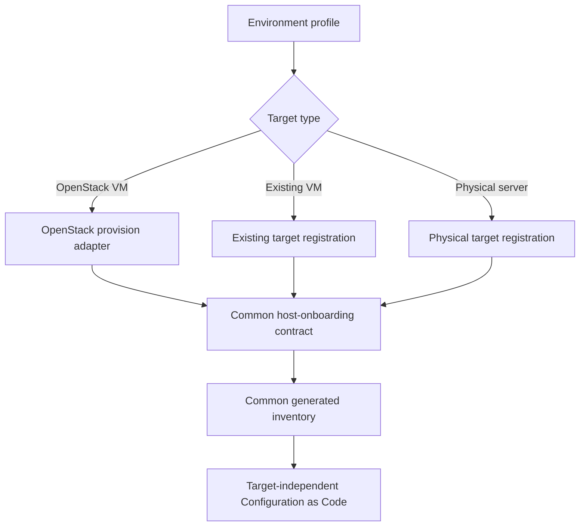

# Target Portability Architecture

## Adapter Model

OpenStack may provision compute. Existing VM and physical-server adapters never claim creation. The user performs hardware, base OS, console, interface, storage, and initial-access prerequisites; Codex-managed validation and automation begin after access is approved.

Future AWS, Azure, Kubernetes, and additional OpenStack adapters implement the same profile, plan, inventory, approval, onboarding, and evidence contracts. Their status is `ROADMAP_ONLY`.

Profiles live under `profiles/templates/` and contain placeholders only. They exclude passwords, tokens, keys, client secrets, MFA material, private cloud configuration, and real environment dumps.
