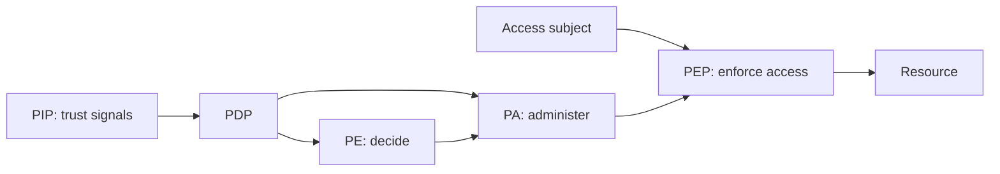
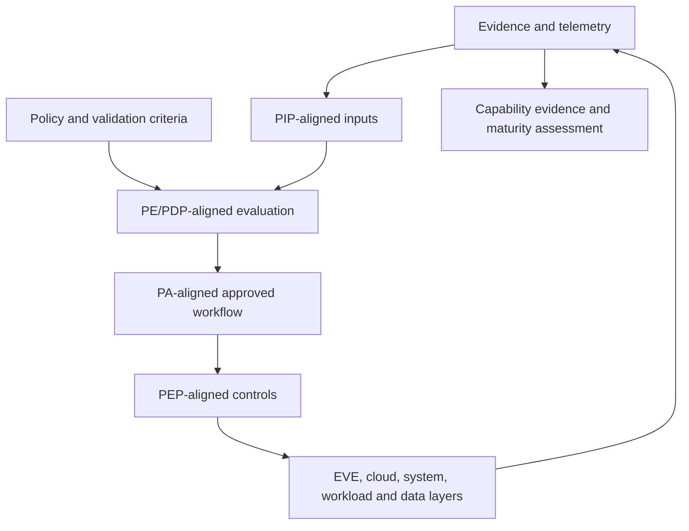

# Zero Trust Reference Architecture

## Source Model

The source separates a control plane from a data plane. The Policy Decision Point (PDP) contains the Policy Engine (PE) and Policy Administrator (PA). A Policy Enforcement Point (PEP) mediates the access path. Policy Information Points (PIP) provide identity, event, network/system behavior, threat-intelligence, compliance, and data-policy signals.

Source: 제로트러스트 가이드라인 2.0, pp. 25-26, Figure 2-2 and logical-component reference.

## Eight Domains

Core pillars are 식별자·신원, 기기 및 엔드포인트, 네트워크, 시스템, 애플리케이션 및 워크로드, and 데이터. Cross-cutting domains are 가시성 및 분석 and 자동화 및 통합.

## Repository Conceptual Alignment

**CONCEPTUAL ALIGNMENT - not a production implementation claim.**

| Source concept | Repository-aligned concept | Current boundary |
|---|---|---|
| PIP | Sanitized telemetry, validation logs, scenario evidence, inventory and policy inputs | Partial design/runtime inputs; not a complete PIP fabric |
| PE/PDP | Policy-as-code plans, validation logic, decision criteria | Conceptual only; no unified production PDP |
| PA | Approved automation and orchestration workflow | Restricted validators exist; no enterprise PA |
| PEP | ACL, Security Group/NSG plans, RBAC, ingress, bastion and forced-command boundaries | Only limited EVE/OpenStack lab paths have runtime evidence |
| Control plane | Git governance, policy, validators, evidence review | Repository and one restricted OpenStack validator |
| Data plane | EVE zones, provider/tenant paths, future services | retired-numbered-case and retired-numbered-case only are runtime validated |

## Current-State Limitations

There is no claim of a complete PDP/PE/PA/PEP/PIP architecture, continuous identity risk evaluation, endpoint posture enforcement, cross-cloud policy plane, automated blocking, or organization-wide Zero Trust operation. The mapping is intended to guide later implementation and evidence collection.
